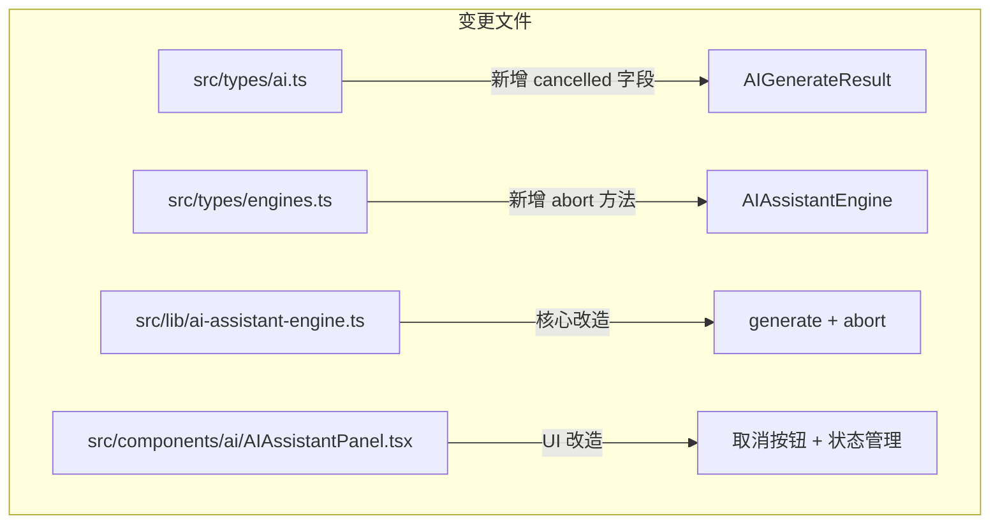
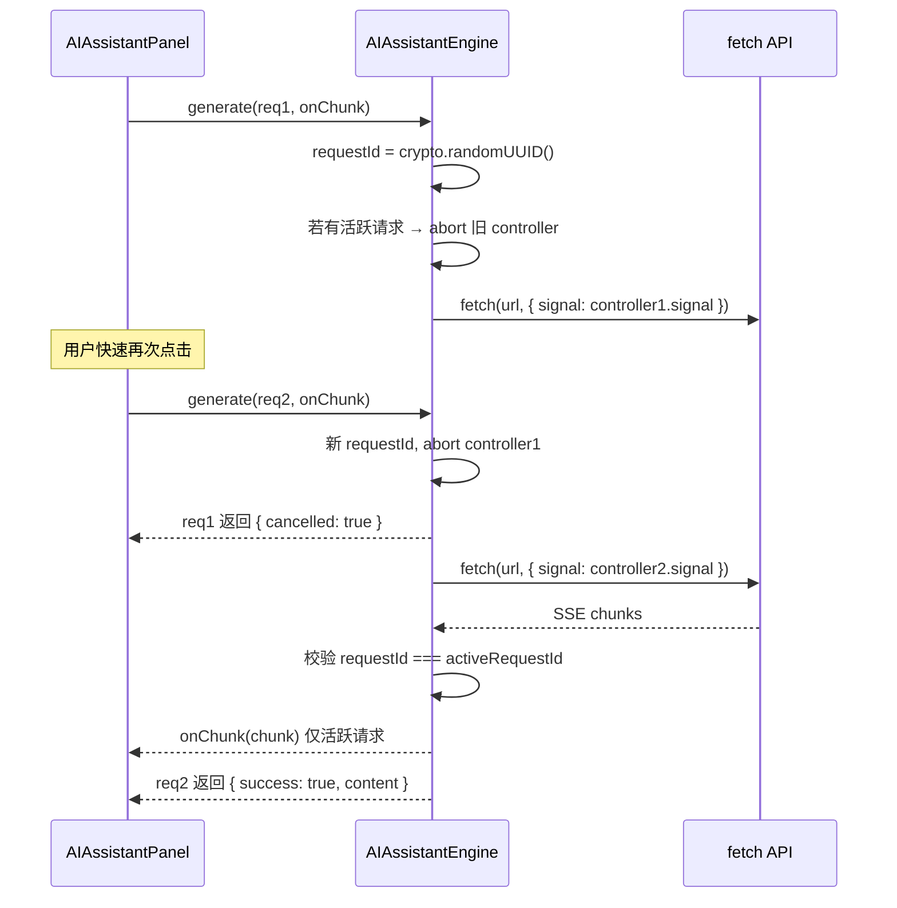

# 设计文档：AI 并发安全机制（ai-concurrency-safety）

## 概述

本设计文档描述火龙果编辑器 AI 辅助写作调用层的并发安全机制实现方案。目标是解决以下三个核心问题：

1. **请求取消**：`generate()` 内部的 `AbortController` 未暴露给调用方，旧请求无法取消
2. **重复提交**：UI 层缺少加载状态锁，用户可多次点击触发并行请求
3. **流式竞态**：两个流式请求同时运行时 `onChunk` 回调交错执行，内容混乱

核心设计思路：在 `createAIAssistantEngine` 内部引入请求 ID 跟踪和 AbortController 管理，对外新增 `abort()` 方法；UI 层利用已有的 `isGenerating` 状态加强按钮禁用和取消交互。

## 架构

### 变更范围



### 请求生命周期



### 竞态保护机制

```mermaid
graph LR
    subgraph "引擎内部状态"
        RID[activeRequestId: string | null]
        AC[activeController: AbortController | null]
    end

    subgraph "generate() 调用"
        G1[调用 1] -->|设置 activeRequestId=id1| RID
        G1 -->|设置 activeController=ctrl1| AC
        G2[调用 2] -->|abort ctrl1| AC
        G2 -->|设置 activeRequestId=id2| RID
        G2 -->|设置 activeController=ctrl2| AC
    end

    subgraph "onChunk 守卫"
        CHK{requestId === activeRequestId?}
        CHK -->|是| DELIVER[传递给调用方]
        CHK -->|否| DROP[静默丢弃]
    end
```

## 组件与接口

### 1. AIGenerateResult 类型扩展

```typescript
// src/types/ai.ts
export interface AIGenerateResult {
  success: boolean;
  content?: string;
  error?: string;
  cancelled?: boolean;  // 新增：请求被取消时为 true
}
```

### 2. AIAssistantEngine 接口扩展

```typescript
// src/types/engines.ts
export interface AIAssistantEngine {
  packContext(chapterId: string): PackedContext;
  buildPrompt(context: PackedContext, userInput: string, template: PromptTemplate): {
    systemPrompt: string;
    userPrompt: string;
  };
  generate(request: AIGenerateRequest, onChunk?: (chunk: string) => void): Promise<AIGenerateResult>;
  validateConfig(provider: AIProvider): { valid: boolean; errors: string[] };
  abort(): void;  // 新增：主动取消当前请求
}
```

### 3. ai-assistant-engine.ts 内部改造

引擎工厂函数内部新增两个闭包变量：

```typescript
export function createAIAssistantEngine(deps: AIAssistantEngineDeps): AIAssistantEngine {
  const { chapterStore, characterStore, worldStore, timelineStore, aiStore } = deps;

  // 新增：并发控制状态
  let activeRequestId: string | null = null;
  let activeController: AbortController | null = null;

  return {
    // packContext, buildPrompt, validateConfig 不变

    abort(): void {
      if (activeController) {
        activeController.abort();
        activeController = null;
      }
      activeRequestId = null;
    },

    async generate(request, onChunk): Promise<AIGenerateResult> {
      // 1. 生成唯一请求 ID
      const requestId = crypto.randomUUID();

      // 2. 自动取消上一个活跃请求
      if (activeController) {
        activeController.abort();
      }

      // 3. 创建新的 AbortController
      const controller = new AbortController();
      activeRequestId = requestId;
      activeController = controller;

      // 4. 超时控制合并到同一个 controller
      const provider = aiStore.getActiveProvider();
      // ... 配置验证逻辑不变 ...

      const timeoutId = setTimeout(() => {
        if (activeRequestId === requestId) {
          controller.abort();
        }
      }, provider.timeoutMs);

      try {
        const response = await fetch(url, {
          // ...
          signal: controller.signal,
        });

        // 流式响应中的 onChunk 守卫
        if (onChunk && response.body) {
          // 包装 onChunk，加入请求 ID 校验
          const guardedOnChunk = (chunk: string) => {
            if (activeRequestId === requestId) {
              onChunk(chunk);
            }
            // 否则静默丢弃
          };
          // ... 使用 guardedOnChunk 替代 onChunk ...
        }

        // 请求完成后清理
        if (activeRequestId === requestId) {
          activeRequestId = null;
          activeController = null;
        }

        return { success: true, content };
      } catch (error) {
        clearTimeout(timeoutId);

        // 区分取消和超时
        if (error instanceof DOMException && error.name === 'AbortError') {
          if (activeRequestId !== requestId) {
            // 被新请求取消，返回 cancelled 标识
            return { success: false, cancelled: true };
          }
          // 超时取消
          return { success: false, error: '请求超时，请增加超时时间或缩短输入内容后重试。' };
        }
        // ... 其他错误处理不变 ...
      }
    },
  };
}
```

### 4. AIAssistantPanel.tsx UI 改造

```typescript
// 关键变更点：

// 1. 面板关闭时取消请求
const handleClose = () => {
  if (isGenerating) {
    aiEngine.abort();
  }
  onClose();
};

// 2. 取消按钮
const handleCancel = () => {
  aiEngine.abort();
  setIsGenerating(false);
  if (!resultRef.current) {
    setError('已取消生成');
  }
};

// 3. 生成按钮区域改造
<div style={s.submitRow}>
  {isGenerating ? (
    <Button variant="secondary" onClick={handleCancel}>
      取消
    </Button>
  ) : (
    <Button variant="primary" onClick={() => handleGenerate()}>
      生成
    </Button>
  )}
</div>

// 4. handleGenerate 中处理 cancelled 结果
if (res.cancelled) {
  // 被自动取消的请求，不更新 UI 状态（由新请求接管）
  return;
}
```

## 数据模型

### 类型变更

| 类型 | 变更 | 说明 |
|------|------|------|
| `AIGenerateResult` | 新增 `cancelled?: boolean` | 区分取消和错误 |
| `AIAssistantEngine` | 新增 `abort(): void` | 暴露取消能力 |

### 引擎内部状态

| 状态 | 类型 | 说明 |
|------|------|------|
| `activeRequestId` | `string \| null` | 当前活跃请求的唯一标识，用于 onChunk 守卫 |
| `activeController` | `AbortController \| null` | 当前活跃请求的 AbortController，用于取消 fetch |

这两个状态作为 `createAIAssistantEngine` 工厂函数的闭包变量存在，不暴露给外部。

### 新增文件

无新增文件。所有改动在现有文件上进行：

```
src/types/ai.ts                          # AIGenerateResult 新增 cancelled 字段
src/types/engines.ts                     # AIAssistantEngine 新增 abort() 方法
src/lib/ai-assistant-engine.ts           # 核心并发控制逻辑
src/components/ai/AIAssistantPanel.tsx   # UI 取消交互
```

## 正确性属性（Correctness Properties）

*正确性属性是在系统所有合法执行中都应成立的特征或行为——本质上是对系统应做什么的形式化陈述。属性是人类可读规格说明与机器可验证正确性保证之间的桥梁。*

本特性的核心逻辑（请求 ID 分配、自动取消、onChunk 守卫、取消结果形态）均为纯函数式或可 mock 的同步/异步逻辑，适合属性基测试。使用 `fast-check`（项目已安装）进行属性基测试，每个属性至少运行 100 次迭代。

### Property 1: 自动取消与独立控制器

*For any* 连续两次 `generate()` 调用，第一次调用的 AbortController 应在第二次调用开始时被 abort，且第二次调用应使用一个全新的 AbortController 实例。

**Validates: Requirements 1.1, 1.4**

### Property 2: 取消结果标识

*For any* 被取消的 `generate()` 调用（无论是被新请求自动取消还是被 `abort()` 主动取消），返回的 `AIGenerateResult` 应满足 `cancelled === true` 且 `success === false`，且不包含错误类型的 `error` 消息。

**Validates: Requirements 1.3**

### Property 3: 请求标识唯一性

*For any* N 次 `generate()` 调用序列（N ≥ 2），每次调用分配的请求标识（requestId）应互不相同。

**Validates: Requirements 3.1**

### Property 4: 仅活跃请求的 onChunk 被传递

*For any* 两个重叠的流式 `generate()` 调用，只有最后一次（活跃）请求的 onChunk 回调会被执行；先前请求的 onChunk 数据应被静默丢弃，不产生任何副作用。

**Validates: Requirements 3.2, 3.3, 3.5**

### Property 5: 任意完成类型后按钮恢复

*For any* `generate()` 调用的完成结果（成功、失败、取消），完成后 `isGenerating` 状态应变为 `false`，生成按钮和写作技能按钮应恢复为可用状态。

**Validates: Requirements 2.3, 2.4**

### Property 6: 取消时保留已接收的部分内容

*For any* 流式 `generate()` 调用在接收到 K 个 chunk（K ≥ 1）后被取消，已接收的 K 个 chunk 拼接的内容应被保留并显示在结果区域。

**Validates: Requirements 4.4**

## 错误处理

### 取消场景错误处理

| 场景 | 处理方式 |
|------|----------|
| 新请求自动取消旧请求 | 旧请求返回 `{ success: false, cancelled: true }`，UI 忽略此结果（不更新状态） |
| 用户主动点击取消 | 调用 `abort()`，`isGenerating` 设为 false；若有部分内容则保留显示，若无内容则显示"已取消生成" |
| 面板关闭时取消 | 调用 `abort()`，面板关闭，无需更新 UI 状态 |
| 取消后仍有 SSE 数据到达 | onChunk 守卫检测 requestId 不匹配，静默丢弃 |

### 超时与取消的区分

当前实现中超时和取消都会触发 `AbortError`。改造后通过 `activeRequestId` 区分：

```
AbortError 触发时：
  if (activeRequestId !== requestId)
    → 被新请求取消 → 返回 { cancelled: true }
  else
    → 超时 → 返回 { error: '请求超时...' }
```

### 并发边界情况

| 场景 | 处理方式 |
|------|----------|
| 快速连续 3+ 次调用 | 每次新调用取消前一个，只有最后一个请求执行到底 |
| abort() 在无活跃请求时调用 | 安全无操作（`activeController` 为 null，跳过） |
| generate() 在 abort() 之后立即调用 | 正常执行，创建新的 requestId 和 controller |
| 流式响应读取中途网络断开 | 现有逻辑已处理：保留已接收内容或返回错误 |

## 测试策略

### 测试框架

- 单元测试：Vitest
- 属性基测试：fast-check（项目已安装 `fast-check@^4.6.0`）
- UI 测试：@testing-library/react
- 每个属性基测试至少 100 次迭代

### 属性基测试（Property-Based Tests）

使用 `fast-check` 实现上述 6 个正确性属性。测试文件：`src/lib/ai-assistant-engine.property.test.ts`

每个测试用注释标注对应的设计属性：

```typescript
// Feature: ai-concurrency-safety, Property 1: 自动取消与独立控制器
// Feature: ai-concurrency-safety, Property 2: 取消结果标识
// Feature: ai-concurrency-safety, Property 3: 请求标识唯一性
// Feature: ai-concurrency-safety, Property 4: 仅活跃请求的 onChunk 被传递
// Feature: ai-concurrency-safety, Property 5: 任意完成类型后按钮恢复
// Feature: ai-concurrency-safety, Property 6: 取消时保留已接收的部分内容
```

**生成策略**：
- 使用 `fc.nat()` 生成随机请求数量（2-10）
- 使用 `fc.string()` 生成随机用户输入
- 使用 `fc.array(fc.string())` 生成随机 SSE chunk 序列
- Mock `fetch` 返回可控的流式响应，通过 `fc.scheduler()` 控制异步时序

### 单元测试（Example-Based Tests）

测试文件：`src/lib/ai-assistant-engine.test.ts`（扩展现有文件）

**引擎层测试**：
- abort() 方法存在且可调用（需求 1.6）
- abort() 在无活跃请求时安全无操作
- 取消后的 AbortController.signal.aborted 为 true（需求 1.2）

**UI 层测试**：
测试文件：`src/components/ai/AIAssistantPanel.test.tsx`

- 生成中状态下生成按钮显示"生成中..."（需求 2.5）
- 生成中状态下显示取消按钮（需求 4.1）
- 点击取消按钮调用 engine.abort()（需求 4.2）
- 点击取消后 isGenerating 变为 false（需求 4.3）
- 取消后无内容时显示"已取消生成"（需求 4.5）
- 面板关闭时取消活跃请求（需求 1.5）
- 新请求发起时清空结果区域（需求 3.4）
- 生成中状态下写作技能按钮禁用（需求 2.2）

### 测试文件结构

```
src/lib/ai-assistant-engine.property.test.ts   # 属性基测试（Property 1-4, 6）
src/lib/ai-assistant-engine.test.ts            # 扩展现有单元测试
src/components/ai/AIAssistantPanel.test.tsx     # UI 交互测试（Property 5 + 示例测试）
```
