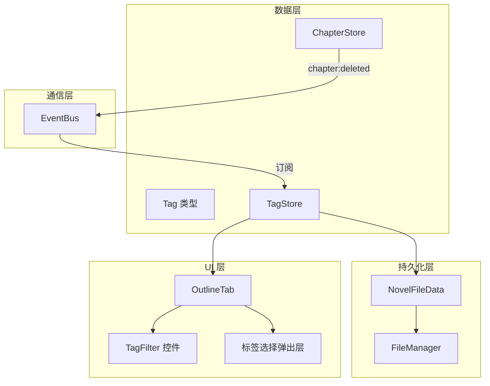

# 设计文档：章节标签与筛选

## 概述

本设计为火龙果编辑器添加章节标签功能。核心思路是新增 `Tag` 类型和 `TagStore`，采用与现有 Store 一致的内存操作 + 防御性拷贝模式。标签与章节的关联关系通过 `Map<chapterId, Set<tagId>>` 管理，通过 EventBus 订阅 `chapter:deleted` 事件实现级联清理。标签数据集成到 `NovelFileData` 中随项目文件持久化。

## 架构



### 设计决策

1. **关联关系存储在 TagStore 中**：使用 `Map<chapterId, Set<tagId>>` 而非在 Chapter 类型上添加 `tagIds` 字段。理由：避免修改已有的 Chapter 类型，降低对现有代码的侵入性，且与需求中 TagStore 负责管理关联关系的描述一致。

2. **预设标签在 TagStore 初始化时创建**：预设标签（草稿、已完稿等）作为普通 Tag 实例存在，用户可以编辑和删除。首次加载项目时如果没有标签数据，则自动创建预设标签。

3. **颜色自动分配**：使用预定义的颜色调色板，按创建顺序循环分配默认颜色。

4. **筛选逻辑为 OR**：选择多个标签时，显示关联了任意一个所选标签的章节（及其祖先），符合需求 4.2 的描述。

## 组件与接口

### Tag 类型

```typescript
// src/types/tag.ts

/** 标签 */
export interface Tag {
  id: string;
  projectId: string;
  name: string;
  color: string; // CSS 颜色值，如 '#E53E3E'
}

/** 标签持久化数据 */
export interface TagData {
  tags: Tag[];
  chapterTagMap: Record<string, string[]>; // chapterId -> tagId[]
}
```

### TagStore 接口

```typescript
// src/types/stores.ts 中新增

export interface TagStore {
  // 标签 CRUD
  createTag(projectId: string, name: string, color?: string): Tag;
  getTag(id: string): Tag | undefined;
  listTags(projectId: string): Tag[];
  updateTag(id: string, updates: Partial<Pick<Tag, 'name' | 'color'>>): void;
  deleteTag(id: string): void;

  // 章节-标签关联
  addTagToChapter(chapterId: string, tagId: string): void;
  removeTagFromChapter(chapterId: string, tagId: string): void;
  getTagsForChapter(chapterId: string): Tag[];
  getChapterIdsForTag(tagId: string): string[];

  // 初始化预设标签
  ensurePresetTags(projectId: string): void;

  // 序列化/反序列化
  exportData(projectId: string): TagData;
  importData(data: TagData): void;
}
```

### OutlineTab 扩展

OutlineTab 组件需要接收新的 props：

```typescript
interface OutlineTabProps {
  projectId: string;
  chapterStore: ChapterStore;
  tagStore: TagStore;           // 新增
  selectedChapterId?: string | null;
  onSelectChapter?: (id: string) => void;
}
```

新增子组件：
- **TagFilter**：大纲面板顶部的标签筛选控件，显示所有可用标签作为可点击的标签按钮
- **TagBadges**：章节节点旁的标签小标记，显示该章节关联的标签
- **TagPopover**：右键菜单触发的标签选择弹出层，支持勾选/取消勾选标签和快速创建新标签

### NovelFileData 扩展

```typescript
export interface NovelFileData {
  // ... 现有字段
  tagData?: TagData; // 新增，可选以兼容旧项目文件
}
```

### EventBus 集成

TagStore 在创建时订阅 `chapter:deleted` 事件，收到事件后遍历 `chapterTagMap` 删除所有被删除章节的关联记录。模式与现有 PlotStore 订阅 `chapter:deleted` 完全一致。

无需新增事件类型，复用现有的 `ChapterDeletedEvent`。

## 数据模型

### Tag

| 字段 | 类型 | 说明 |
|------|------|------|
| id | string | UUID，唯一标识 |
| projectId | string | 所属项目 ID |
| name | string | 标签名称，同项目内唯一 |
| color | string | CSS 颜色值 |

### 章节-标签关联

使用 `Map<string, Set<string>>` 存储，key 为 chapterId，value 为 tagId 集合。序列化时转为 `Record<string, string[]>`。

### 预设标签与颜色

```typescript
const PRESET_TAGS = [
  { name: '草稿', color: '#A0AEC0' },   // 灰色
  { name: '已完稿', color: '#48BB78' }, // 绿色
  { name: '需润色', color: '#ED8936' }, // 橙色
  { name: '待修改', color: '#E53E3E' }, // 红色
  { name: '高潮', color: '#9F7AEA' },   // 紫色
  { name: '伏笔', color: '#4299E1' },   // 蓝色
];

const DEFAULT_COLORS = [
  '#E53E3E', '#ED8936', '#ECC94B', '#48BB78',
  '#38B2AC', '#4299E1', '#667EEA', '#9F7AEA',
  '#ED64A6', '#A0AEC0',
];
```

### NovelFileData 中的 TagData 结构

```json
{
  "tagData": {
    "tags": [
      { "id": "tag-1", "projectId": "proj-1", "name": "草稿", "color": "#A0AEC0" }
    ],
    "chapterTagMap": {
      "chapter-1": ["tag-1", "tag-3"],
      "chapter-2": ["tag-2"]
    }
  }
}
```


## 正确性属性

*正确性属性是在系统所有有效执行中都应成立的特征或行为——本质上是对系统应做什么的形式化陈述。属性是人类可读规格说明与机器可验证正确性保证之间的桥梁。*

### Property 1: 创建标签自动分配颜色

*For any* 有效的标签名称，调用 `createTag(projectId, name)` 不指定颜色时，返回的 Tag 对象 SHALL 包含一个非空的 color 字符串。

**Validates: Requirements 1.2**

### Property 2: 重复标签名称拒绝

*For any* 有效的标签名称，在同一项目中先创建一个该名称的标签后，再次以相同名称调用 `createTag` SHALL 抛出错误，且标签列表长度不变。

**Validates: Requirements 1.3**

### Property 3: 删除标签级联清除关联

*For any* 标签和任意数量的章节关联，删除该标签后，所有之前关联该标签的章节调用 `getTagsForChapter` SHALL 不再包含该标签。

**Validates: Requirements 1.5**

### Property 4: 多对多关联完整性

*For any* 一组不同的标签和一组不同的章节 ID，将每个标签添加到每个章节后，`getTagsForChapter(chapterId)` SHALL 返回该章节关联的所有标签，`getChapterIdsForTag(tagId)` SHALL 返回该标签关联的所有章节 ID。

**Validates: Requirements 2.1, 2.3, 2.4, 2.6**

### Property 5: 移除关联后标签不再出现

*For any* 章节和标签的关联，调用 `removeTagFromChapter` 后，`getTagsForChapter` SHALL 不再包含该标签，但该章节的其他标签关联 SHALL 保持不变。

**Validates: Requirements 2.2**

### Property 6: 章节删除级联清除关联

*For any* 章节及其关联的标签，当 EventBus 发出 `chapter:deleted` 事件后，`getTagsForChapter` 对被删除章节 SHALL 返回空列表，且其他章节的标签关联 SHALL 保持不变。

**Validates: Requirements 2.5**

### Property 7: 标签筛选显示匹配章节及祖先

*For any* 章节树结构和标签关联，当选择一组筛选标签时，可见章节集合 SHALL 恰好等于「关联了任意所选标签的章节」与「这些章节的所有祖先章节」的并集。当筛选标签集合为空时，所有章节 SHALL 可见。

**Validates: Requirements 4.2, 4.3, 4.4**

### Property 8: 标签数据序列化往返一致性

*For any* 有效的标签状态（标签定义 + 章节-标签关联），执行 `exportData` → `importData` → `exportData` 后，两次 `exportData` 的结果 SHALL 等价。

**Validates: Requirements 6.1, 6.2, 6.3**

## 错误处理

| 场景 | 处理方式 |
|------|----------|
| 创建重复名称标签 | `createTag` 抛出 Error，消息为「标签名称"X"已存在」 |
| 标签名称为空或纯空白 | `createTag` 抛出 Error，消息为「标签名称不能为空」 |
| 更新标签名称为已存在名称 | `updateTag` 抛出 Error，消息为「标签名称"X"已存在」 |
| 添加不存在的标签到章节 | `addTagToChapter` 静默忽略（标签 ID 无效时不建立关联） |
| 加载旧版项目文件无 tagData | `importData` 接收 undefined，TagStore 保持空状态，`ensurePresetTags` 创建预设标签 |
| 加载的 tagData 格式异常 | 使用 try-catch 包裹反序列化，失败时回退到空状态并创建预设标签 |

## 测试策略

### 属性基测试（Property-Based Testing）

使用 `fast-check` + `vitest`，每个属性测试至少运行 100 次迭代。

测试文件：`src/stores/tag-store.property.test.ts`

需要实现的属性测试：
- Property 1-6, 8：纯 TagStore 逻辑测试，直接调用 store 方法
- Property 7：筛选逻辑测试，提取为纯函数 `filterChaptersByTags` 后独立测试

每个测试需标注对应的设计属性：
```
// Feature: chapter-tags, Property N: {property_text}
```

生成器设计：
- **tagNameArb**：生成 2-8 个中文字符的标签名称
- **colorArb**：从预定义颜色列表中随机选取
- **chapterTreeArb**：生成随机的章节树结构（卷-章-节层级）
- **tagAssociationArb**：生成随机的章节-标签关联映射

### 单元测试

测试文件：`src/stores/tag-store.test.ts`

覆盖场景：
- 预设标签初始化（6 个预设标签名称和颜色正确）
- 标签 CRUD 基本操作
- 空名称/纯空白名称拒绝
- 更新标签名称和颜色
- 右键菜单「管理标签」交互流程

### UI 组件测试

测试文件：`src/components/sidebar/OutlineTab.test.ts`（扩展现有测试）

覆盖场景：
- TagFilter 控件渲染和交互
- TagBadges 在章节节点旁正确显示
- 无标签章节不显示标签标记
- 标签选择弹出层的勾选/取消勾选交互
- 快速创建新标签入口
