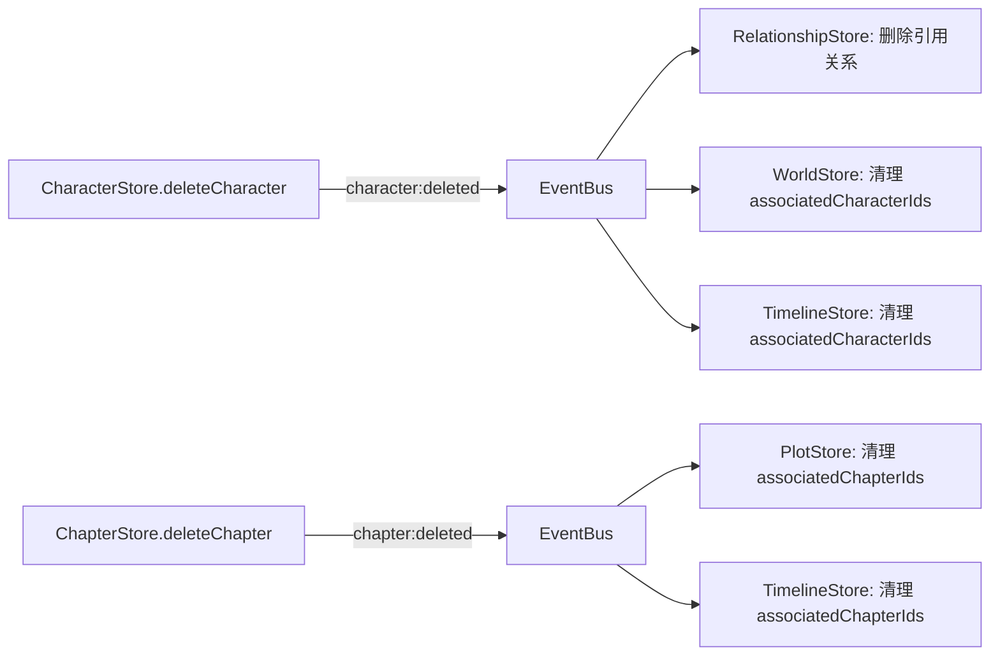

# 设计文档：火龙果编辑器全面质量自检

## 概述

本设计文档针对火龙果编辑器的 18 个需求领域，制定系统性的测试策略和必要的代码修复方案。核心目标是：

1. **补全缺失的级联删除逻辑**（角色删除未级联清理关系、世界观条目、时间线引用）
2. **建立全面的属性基测试覆盖**（利用 fast-check 验证 Store 防御性拷贝、一致性引擎、导出引擎等核心逻辑）
3. **补充边界场景的单元测试**（弹窗回填、空状态 UI、错误处理等）
4. **复用已有测试**，避免重复覆盖

## 架构

本次质量审计不改变系统架构，仅在以下层面进行修改：

```
┌─────────────────────────────────────────────────────┐
│                    测试层（新增/增强）                  │
│  属性基测试 │ 单元测试 │ UI 组件测试 │ 集成测试        │
└─────────────────────────────────────────────────────┘
         ↕                      ↕              ↕
┌─────────────────────────────────────────────────────┐
│                   代码修复层                          │
│  角色级联删除 │ 章节级联清理 │ EventBus 扩展          │
└─────────────────────────────────────────────────────┘
```

### 需要修复的代码缺陷

经过代码审查，发现以下级联删除缺陷需要修复：

1. **角色删除未级联清理关系**：`CharacterStore.deleteCharacter` 仅删除角色和快照，未通知 `RelationshipStore` 清理引用该角色的关系记录。需要通过 EventBus 发出 `character:deleted` 事件。
2. **角色删除未清理 WorldEntry.associatedCharacterIds**：删除角色后，WorldEntry 中仍保留已删除角色的 ID。需要 WorldStore 订阅 `character:deleted` 事件。
3. **角色删除未清理 TimelinePoint.associatedCharacterIds**：同上，TimelineStore 需要订阅 `character:deleted` 事件。
4. **章节删除未清理 PlotThread.associatedChapterIds**：删除章节后，PlotThread 中仍保留已删除章节的 ID。需要通过 EventBus 发出 `chapter:deleted` 事件。
5. **章节删除未清理 TimelinePoint.associatedChapterIds**：同上。

### 修复方案



需要扩展 EventBus 事件类型：

```typescript
// 新增事件类型
type CharacterEvent = { type: 'character:deleted'; characterId: string };
type ChapterEvent = { type: 'chapter:deleted'; chapterIds: string[] }; // 包含所有被删除的 ID（含子章节）
```

## 组件与接口

### 需要修改的组件

| 组件 | 修改内容 |
|------|----------|
| `src/types/event-bus.ts` | 新增 `character:deleted` 和 `chapter:deleted` 事件类型 |
| `src/stores/character-store.ts` | `deleteCharacter` 发出 `character:deleted` 事件 |
| `src/stores/chapter-store.ts` | 接受 EventBus 参数，`deleteChapter` 发出 `chapter:deleted` 事件 |
| `src/stores/relationship-store.ts` | 订阅 `character:deleted` 事件，清理引用关系 |
| `src/stores/world-store.ts` | 接受 EventBus 参数，订阅 `character:deleted` 事件 |
| `src/stores/timeline-store.ts` | 订阅 `character:deleted` 和 `chapter:deleted` 事件 |
| `src/stores/plot-store.ts` | 接受 EventBus 参数，订阅 `chapter:deleted` 事件 |
| `src/pages/EditorPage.tsx` | 传递 EventBus 给新增支持的 Store |

### 新增测试文件

| 测试文件 | 覆盖需求 |
|----------|----------|
| `src/stores/defensive-copy.property.test.ts` | 需求 15（Store 防御性拷贝） |
| `src/stores/cascade-delete.test.ts` | 需求 2（级联删除） |
| `src/stores/cascade-delete.property.test.ts` | 需求 2（级联删除属性测试） |
| `src/stores/chapter-reorder.property.test.ts` | 需求 4（章节排序） |
| `src/stores/snapshot-store.property.test.ts` | 需求 8（快照边界） |
| `src/stores/ai-history.test.ts` | 需求 17（AI 历史记录） |
| `src/lib/consistency-engine.property.test.ts` | 需求 9（一致性检查） |
| `src/lib/export-engine.property.test.ts` | 需求 7（导出功能） |
| `src/lib/file-manager.property.test.ts` | 需求 13（文件管理） |
| `src/components/dialogs/__tests__/dialog-population.test.tsx` | 需求 1（弹窗回填） |

### 已有测试覆盖情况

以下需求已有测试覆盖，无需新增：

| 需求 | 已有测试文件 | 覆盖状态 |
|------|-------------|----------|
| 需求 4.1-4.3 | `OutlineTab.test.ts` | 完全覆盖 |
| 需求 5.4 | `ai-assistant-engine.property.test.ts` | 完全覆盖（Property 1-4） |
| 需求 10.1-10.4 | `world-category-expansion.property.test.ts` | 完全覆盖（Property 2-4） |
| 需求 11.4 | `theme-store.property.test.ts` | 完全覆盖 |
| 需求 12.1-12.2 | `daily-goal-store.property.test.ts` | 完全覆盖（Property 3） |
| 需求 16.1-16.6 | `skill-parser.test.ts` | 完全覆盖（含属性测试） |

## 数据模型

无新增数据模型。仅扩展 EventBus 事件联合类型：

```typescript
// src/types/event-bus.ts 扩展
export type AppEvent =
  | { type: 'timeline:created'; point: TimelinePoint }
  | { type: 'timeline:updated'; point: TimelinePoint }
  | { type: 'timeline:deleted'; pointId: string }
  | { type: 'character:deleted'; characterId: string }      // 新增
  | { type: 'chapter:deleted'; chapterIds: string[] };       // 新增
```


## 正确性属性

*属性（Property）是一种在系统所有有效执行中都应成立的特征或行为——本质上是对系统应做什么的形式化陈述。属性是人类可读规范与机器可验证正确性保证之间的桥梁。*

### 属性 1：Store 防御性拷贝——嵌套结构不可变性

*对于任意* Store（CharacterStore、WorldStore、TimelineStore、PlotStore）和任意实体，通过 get 方法获取的返回值中的嵌套数组或对象被外部修改后，再次通过 get 方法获取的值应与修改前一致，内部状态不受影响。

**验证: 需求 15.2, 15.4, 15.5, 15.6, 15.7, 15.8**

### 属性 2：Store 防御性拷贝——简单字段不可变性

*对于任意* Store（ChapterStore、RelationshipStore）和任意实体，通过 get 方法获取的返回值的简单字段被外部修改后，再次通过 get 方法获取的值应与修改前一致。

**验证: 需求 15.1, 15.3**

### 属性 3：角色删除级联完整性

*对于任意*项目中的角色，删除该角色后：(a) CharacterStore 中不存在该角色的时间线快照；(b) RelationshipStore 中不存在引用该角色的关系记录；(c) WorldEntry 的 associatedCharacterIds 中不包含该角色 ID；(d) TimelinePoint 的 associatedCharacterIds 中不包含该角色 ID。

**验证: 需求 2.1, 2.2, 2.3, 2.4**

### 属性 4：时间线删除级联完整性

*对于任意*时间线节点，删除该节点后：(a) RelationshipStore 中引用该节点的关系记录被删除；(b) CharacterStore 中引用该节点的快照被删除。

**验证: 需求 2.5**

### 属性 5：章节删除递归完整性

*对于任意*章节树，删除某个章节后，该章节及其所有后代章节都不再存在于 ChapterStore 中。

**验证: 需求 2.6**

### 属性 6：章节删除级联引用清理

*对于任意*章节，删除该章节（及其子章节）后：(a) PlotThread 的 associatedChapterIds 中不包含任何已删除章节的 ID；(b) TimelinePoint 的 associatedChapterIds 中不包含任何已删除章节的 ID。

**验证: 需求 2.7**

### 属性 7：章节拖拽后 sortOrder 连续无重复

*对于任意*章节树和任意合法的拖拽操作（reorderChapter），操作完成后同一父节点下所有子章节的 sortOrder 值应从 0 开始连续递增，无重复。

**验证: 需求 4.4, 4.5**

### 属性 8：关系时间线筛选正确性

*对于任意*关系集合和时间节点，`listRelationshipsAtTimeline` 返回的关系应满足：startTimelinePoint.sortOrder ≤ 目标时间节点.sortOrder，且（如果有 endTimelinePointId）endTimelinePoint.sortOrder ≥ 目标时间节点.sortOrder。

**验证: 需求 3.6**

### 属性 9：一致性引擎精确匹配排除

*对于任意*角色名和包含该角色名精确匹配的章节内容，ConsistencyEngine.checkChapter 不应将精确匹配报告为问题。

**验证: 需求 9.4, 9.5**

### 属性 10：一致性引擎无重复报告

*对于任意*章节内容和角色列表，ConsistencyEngine.checkChapter 返回的问题列表中不应存在两个具有相同 offset 和 length 的问题。

**验证: 需求 9.6**

### 属性 11：applySuggestion 精确替换

*对于任意*章节内容和 ConsistencyIssue，applySuggestion 应仅替换指定 offset 和 length 处的文本为 suggestedName，内容的其余部分保持不变。

**验证: 需求 9.7**

### 属性 12：HTML 转义完整性

*对于任意*包含 HTML 特殊字符（<、>、&、"、'）的字符串，escapeHtml 的输出不应包含未转义的特殊字符（即不包含裸露的 <、>、&、"、'）。

**验证: 需求 7.2**

### 属性 13：文件名清理完整性

*对于任意*字符串，sanitizeFilename 的输出不应包含文件系统非法字符（/ \ : * ? " < > |）。

**验证: 需求 7.3**

### 属性 14：Markdown 标记去除完整性

*对于任意* Markdown 内容，stripMarkdown 的输出不应包含 Markdown 标记符号（#、*、_、~~、```、>、---、- 列表标记等）。

**验证: 需求 7.4**

### 属性 15：快照删除后列表一致性

*对于任意*快照集合，删除某个快照后，listSnapshots 返回的列表不应包含已删除的快照。

**验证: 需求 8.5**

### 属性 16：AI 历史记录上限约束

*对于任意*数量的 addHistoryRecord 调用，listHistory 返回的记录数不应超过 50 条。

**验证: 需求 17.1**

### 属性 17：AI 历史记录时间倒序

*对于任意*项目的历史记录，listHistory 返回的记录应按 timestamp 降序排列（最新的在前）。

**验证: 需求 17.4**

### 属性 18：Date 字段序列化往返

*对于任意*有效的 NovelFileData，serialize 后再 deserialize 应正确恢复 project.createdAt 和 project.updatedAt 为 Date 对象，且时间值等价。

**验证: 需求 13.5**

## 错误处理

### 级联删除错误处理

- 级联删除通过 EventBus 异步通知，各 Store 独立处理。如果某个 Store 的清理逻辑抛出异常，不影响其他 Store 的清理操作。
- EventBus 的 `emit` 方法应捕获监听器异常并记录到 console.error，不中断事件传播。

### 存储错误处理

- localStorage 操作（快照、AI 历史、主题、日更目标）统一使用 try-catch 包裹，写入失败时静默降级。
- QuotaExceededError 在快照创建时向上抛出，由 UI 层显示提示。

### AI 请求错误处理

- 已有完善的错误分类（401/403、429、超时、网络错误、取消）。
- 流式响应中断时保留已接收内容。

## 测试策略

### 测试框架

- **单元测试**: Vitest
- **属性基测试**: fast-check（每个属性最少 100 次迭代）
- **UI 组件测试**: @testing-library/react + jsdom
- **测试环境**: jsdom（vitest.config.ts 中配置）

### 测试文件命名规范

| 类型 | 命名格式 | 示例 |
|------|----------|------|
| 单元测试 | `{module}.test.ts` | `cascade-delete.test.ts` |
| 属性基测试 | `{module}.property.test.ts` | `defensive-copy.property.test.ts` |
| UI 组件测试 | `{component}.test.tsx` | `dialog-population.test.tsx` |

### 属性基测试配置

- 使用 fast-check 库
- 每个属性测试最少 100 次迭代（`{ numRuns: 100 }`）
- 每个属性测试必须引用设计文档中的属性编号
- 标签格式: `Feature: comprehensive-quality-audit, Property {number}: {property_text}`

### 测试分层

**第一层：属性基测试（核心逻辑验证）**

| 属性 | 测试文件 | 覆盖需求 |
|------|----------|----------|
| 属性 1-2 | `defensive-copy.property.test.ts` | 需求 15 |
| 属性 3-6 | `cascade-delete.property.test.ts` | 需求 2 |
| 属性 7 | `chapter-reorder.property.test.ts` | 需求 4 |
| 属性 8 | `relationship-store.test.ts`（增强） | 需求 3 |
| 属性 9-11 | `consistency-engine.property.test.ts` | 需求 9 |
| 属性 12-14 | `export-engine.property.test.ts` | 需求 7 |
| 属性 15 | `snapshot-store.property.test.ts` | 需求 8 |
| 属性 16-17 | `ai-history.property.test.ts` | 需求 17 |
| 属性 18 | `file-manager.property.test.ts` | 需求 13 |

**第二层：单元测试（边界场景和具体行为）**

| 测试文件 | 覆盖需求 |
|----------|----------|
| `cascade-delete.test.ts` | 需求 2.8, 2.9 |
| `consistency-engine.test.ts`（增强） | 需求 9.1, 9.2, 9.3 |
| `snapshot-store.test.ts`（增强） | 需求 8.1, 8.2, 8.3, 8.4 |
| `ai-assistant-engine.test.ts`（增强） | 需求 5.3, 5.5, 5.6, 5.7, 5.8 |
| `ai-history.test.ts` | 需求 17.2, 17.3, 17.5 |
| `daily-goal-store.test.ts`（增强） | 需求 12.3, 12.4 |
| `theme-store.test.ts`（增强） | 需求 11.1, 11.2, 11.3 |
| `world-store.test.ts`（增强） | 需求 10.5 |
| `project-store.test.ts`（增强） | 需求 13.4 |

**第三层：UI 组件测试**

| 测试文件 | 覆盖需求 |
|----------|----------|
| `dialog-population.test.tsx` | 需求 1.1-1.7 |
| `AIAssistantPanel.test.tsx`（增强） | 需求 5.1, 5.2, 18.7 |
| 各 Tab 组件测试 | 需求 18.1-18.5 |

### 已有测试复用

以下已有测试完全覆盖对应需求，无需新增：

- `OutlineTab.test.ts` → 需求 4.1-4.3
- `ai-assistant-engine.property.test.ts` → 需求 5.4（并发控制 Property 1-4）
- `world-category-expansion.property.test.ts` → 需求 10.1-10.4
- `theme-store.property.test.ts` → 需求 11.4
- `daily-goal-store.property.test.ts` → 需求 12.1-12.2
- `skill-parser.test.ts` → 需求 16.1-16.6（含属性测试）
- `export-typography.property.test.ts` → 导出排版 CSS 生成
