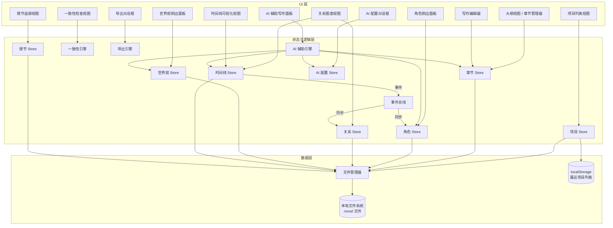
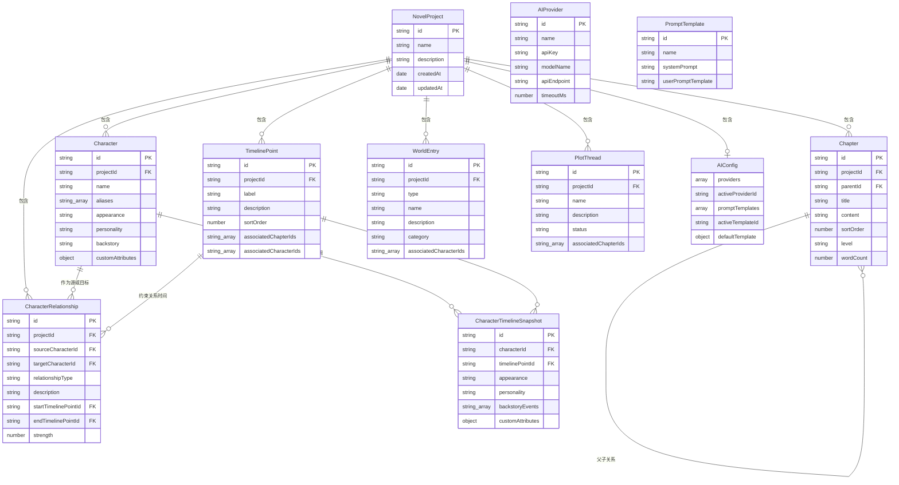

# 设计文档：小说辅助编辑器（Novel Assistant Editor）

## 概述

小说辅助编辑器是一个面向小说作者的综合性单页应用。它提供集成化的写作环境，涵盖小说项目管理、章节组织、角色与世界观数据库维护、角色关系图谱可视化、时间线追踪、Markdown 写作编辑、AI 辅助写作、一致性检查以及多格式导出功能。

应用采用纯客户端架构，使用 React + TypeScript 构建。数据以 `.novel` 项目文件的形式保存在用户本地磁盘上，通过 File System Access API 实现文件的打开、保存和自动保存。每本小说对应一个独立的 `.novel` 文件（本质为 JSON 格式），包含该小说的所有章节、角色、世界观、时间线等完整数据。时间线系统作为核心协调机制，将角色属性、社会关系和关系图谱统一到一组时间节点上。

### UI 规范参考

详细的 UI 设计规范（包括布局、色彩、字体、组件样式、页面结构等）请参见：#[[file:ui-spec.md]]

### 关键设计决策

1. **纯客户端架构**：无后端服务器，所有数据保存在本地 `.novel` 文件中，支持离线使用。
2. **File System Access API**：使用浏览器原生文件系统访问 API，让用户像操作 Word 文档一样打开、编辑、保存小说项目文件。
3. **`.novel` 项目文件格式**：每本小说为一个独立的 JSON 文件（扩展名 `.novel`），包含项目元数据和所有关联数据（章节、角色、关系、世界观、时间线、情节线索）。
4. **React + TypeScript**：强类型系统适合复杂数据模型（角色、关系、时间节点），React 提供组件化 UI。
5. **统一时间节点注册表**：TimelineStore 拥有所有 TimelinePoint 定义，CharacterStore 和 RelationshipStore 通过 ID 引用，确保全局一致性。
6. **事件驱动同步**：TimelineStore 变更时间节点时发出事件，CharacterStore 和 RelationshipStore 订阅事件保持同步。
7. **Markdown 优先写作**：WritingEditor 使用 Markdown 编辑器（如 CodeMirror 6），支持实时预览、自动保存和撤销/重做。
8. **客户端导出**：PDF 通过 jsPDF/html2pdf 生成，EPUB 通过 epub-gen-memory 生成，Markdown 通过字符串拼接生成，按章节 TXT 通过 JSZip 打包为 ZIP 文件。
9. **最近项目列表**：使用 localStorage 记录最近打开的文件路径，方便快速访问。
10. **AI 辅助写作**：通过浏览器直接调用外部 AI 模型 API（如 OpenAI、Anthropic、本地模型等），无需后端中转。上下文打包器自动收集章节、角色、世界观等信息组装 Prompt，支持多模型提供商配置和自定义 Prompt 模板。

## 架构

应用采用模块化架构，包含共享的内存数据层和事件总线用于跨模块通信。数据持久化通过 File System Access API 直接读写本地 `.novel` 文件。



### 模块职责

- **ProjectStore**：管理当前打开的 NovelProject。负责新建、打开、保存、关闭项目文件。通过 FileManager 与本地文件系统交互。
- **FileManager**：封装 File System Access API，提供文件选择、读取、写入能力。管理文件句柄（FileSystemFileHandle）的生命周期。
- **ChapterStore**：章节的 CRUD 操作，支持层级排序（卷 > 章 > 节），管理排序位置和字数统计。
- **CharacterStore**：角色的 CRUD 操作，支持自定义属性，管理时间线感知的属性快照。
- **RelationshipStore**：角色关系的 CRUD 操作，支持时间维度查询（查询某个 TimelinePoint 时有效的关系）。
- **WorldStore**：世界观条目的 CRUD 操作（地点、势力/组织、背景设定/规则）。
- **TimelineStore**：时间节点的 CRUD 操作，创建/更新/删除时发出事件，维护规范排序。
- **PlotStore**：情节线索的 CRUD 操作，支持状态追踪和章节关联。
- **ConsistencyEngine**：纯逻辑模块。接收章节文本和角色名称/别名，返回相似度匹配结果。
- **ExportEngine**：纯逻辑模块。接收结构化小说数据，生成 PDF/EPUB/Markdown 输出。
- **EventBus**：简单的发布/订阅机制，用于跨模块同步（主要是时间线事件）。
- **AIAssistantEngine**：纯逻辑模块。负责上下文打包（收集章节、角色、世界观、时间线信息）、Prompt 组装（应用模板和占位符替换）、调用 AI 模型 API（通过浏览器 fetch 发送 HTTP 请求）和流式响应处理。
- **AIAssistantStore**：管理 AI 配置数据（模型提供商列表、当前选中的提供商、Prompt 模板），配置持久化在 `.novel` 文件中。

## 组件与接口

### FileManager（文件管理器）

```typescript
// .novel 项目文件的完整数据结构
interface NovelFileData {
  version: number; // 文件格式版本号
  project: NovelProject; // 项目元数据
  chapters: Chapter[]; // 所有章节
  characters: Character[]; // 所有角色
  characterSnapshots: CharacterTimelineSnapshot[]; // 所有角色时间快照
  relationships: CharacterRelationship[]; // 所有角色关系
  timelinePoints: TimelinePoint[]; // 所有时间节点
  worldEntries: WorldEntry[]; // 所有世界观条目
  plotThreads: PlotThread[]; // 所有情节线索
  aiConfig?: AIConfig; // AI 辅助写作配置（可选）
}

interface FileManager {
  // 显示文件选择器，让用户选择保存路径，创建新的 .novel 文件
  createNewFile(data: NovelFileData): Promise<FileSystemFileHandle>;
  // 显示文件选择器，让用户选择 .novel 文件并读取内容
  openFile(): Promise<{ handle: FileSystemFileHandle; data: NovelFileData }>;
  // 将数据写入已有的文件句柄（用于保存和自动保存）
  saveFile(handle: FileSystemFileHandle, data: NovelFileData): Promise<void>;
  // 检查浏览器是否支持 File System Access API
  isSupported(): boolean;
}
```

### ProjectStore（项目 Store）

```typescript
interface NovelProject {
  id: string;
  name: string;
  description: string;
  createdAt: Date;
  updatedAt: Date;
}

// 最近打开的项目记录（存储在 localStorage 中）
interface RecentProject {
  name: string;
  filePath: string; // 文件路径（仅供显示，实际打开需重新选择文件）
  lastOpenedAt: Date;
}

interface ProjectStore {
  // 新建项目：弹出文件选择器选择保存路径，创建 .novel 文件
  createProject(name: string, description: string): Promise<NovelProject>;
  // 打开项目：弹出文件选择器选择 .novel 文件，加载所有数据到内存
  openProject(): Promise<NovelProject>;
  // 保存项目：将内存中的所有数据写入当前文件句柄
  saveProject(): Promise<void>;
  // 关闭项目：清空内存数据，释放文件句柄
  closeProject(): Promise<void>;
  // 获取当前打开的项目
  getCurrentProject(): NovelProject | null;
  // 获取最近打开的项目列表（从 localStorage 读取）
  getRecentProjects(): RecentProject[];
  // 更新项目元数据
  updateProject(updates: Partial<Pick<NovelProject, 'name' | 'description'>>): Promise<void>;
}
```

### ChapterStore（章节 Store）

```typescript
interface Chapter {
  id: string;
  projectId: string;
  parentId: string | null; // null 表示顶级节点（卷）
  title: string;
  content: string; // Markdown 格式
  sortOrder: number;
  level: 'volume' | 'chapter' | 'section';
  wordCount: number;
}

interface ChapterStore {
  createChapter(projectId: string, parentId: string | null, title: string, level: Chapter['level']): Chapter;
  getChapter(id: string): Chapter | undefined;
  listChapters(projectId: string): Chapter[]; // 返回按树形排序的列表
  updateChapter(id: string, updates: Partial<Pick<Chapter, 'title' | 'content' | 'sortOrder' | 'parentId'>>): void;
  deleteChapter(id: string): void; // 级联删除子章节
  reorderChapter(id: string, newSortOrder: number, newParentId?: string | null): void;
  getWordCount(id: string): number;
}
```

### CharacterStore（角色 Store）

```typescript
interface Character {
  id: string;
  projectId: string;
  name: string;
  aliases: string[];
  appearance: string;
  personality: string;
  backstory: string;
  customAttributes: Record<string, string>;
}

interface CharacterTimelineSnapshot {
  id: string;
  characterId: string;
  timelinePointId: string;
  appearance: string;
  personality: string;
  backstoryEvents: string[];
  customAttributes: Record<string, string>;
}

interface CharacterStore {
  createCharacter(projectId: string, data: Omit<Character, 'id' | 'projectId'>): Character;
  getCharacter(id: string): Character | undefined;
  listCharacters(projectId: string): Character[];
  searchCharacters(projectId: string, query: string): Character[]; // 按姓名、别名模糊匹配
  updateCharacter(id: string, updates: Partial<Omit<Character, 'id' | 'projectId'>>): void;
  deleteCharacter(id: string): void; // 级联删除关系和快照
  getSnapshotAtTimeline(characterId: string, timelinePointId: string): CharacterTimelineSnapshot | undefined;
  setSnapshotAtTimeline(characterId: string, timelinePointId: string, data: Partial<Omit<CharacterTimelineSnapshot, 'id' | 'characterId' | 'timelinePointId'>>): void;
}
```

### RelationshipStore（关系 Store）

```typescript
interface CharacterRelationship {
  id: string;
  projectId: string;
  sourceCharacterId: string;
  targetCharacterId: string;
  relationshipType: 'family' | 'friend' | 'enemy' | 'mentor' | 'lover' | 'ally' | 'superior' | 'custom';
  customTypeName?: string;
  description: string;
  startTimelinePointId: string;
  endTimelinePointId?: string; // undefined 表示关系仍然有效
  strength: number; // 1-10
}

interface RelationshipStore {
  createRelationship(data: Omit<CharacterRelationship, 'id'>): CharacterRelationship;
  getRelationship(id: string): CharacterRelationship | undefined;
  listRelationships(projectId: string): CharacterRelationship[];
  listRelationshipsAtTimeline(projectId: string, timelinePointId: string): CharacterRelationship[];
  listRelationshipsForCharacter(characterId: string): CharacterRelationship[];
  updateRelationship(id: string, updates: Partial<Omit<CharacterRelationship, 'id' | 'projectId'>>): void;
  deleteRelationship(id: string): void;
  filterByType(projectId: string, type: CharacterRelationship['relationshipType']): CharacterRelationship[];
}
```

### TimelineStore（时间线 Store）

```typescript
interface TimelinePoint {
  id: string;
  projectId: string;
  label: string;
  description: string;
  sortOrder: number;
  associatedChapterIds: string[];
  associatedCharacterIds: string[];
}

interface TimelineStore {
  createTimelinePoint(data: Omit<TimelinePoint, 'id'>): TimelinePoint;
  getTimelinePoint(id: string): TimelinePoint | undefined;
  listTimelinePoints(projectId: string): TimelinePoint[]; // 按 sortOrder 排序
  updateTimelinePoint(id: string, updates: Partial<Omit<TimelinePoint, 'id' | 'projectId'>>): void;
  deleteTimelinePoint(id: string): void;
  reorderTimelinePoint(id: string, newSortOrder: number): void;
  filterByChapter(projectId: string, chapterId: string): TimelinePoint[];
  filterByCharacter(projectId: string, characterId: string): TimelinePoint[];
  getReferences(id: string): { characterSnapshots: number; relationships: number }; // 用于删除确认
}
```

### WorldStore（世界观 Store）

```typescript
interface WorldEntry {
  id: string;
  projectId: string;
  type: 'location' | 'faction' | 'rule';
  name: string;
  description: string;
  category?: string; // 用于 'rule' 类型
  associatedCharacterIds: string[];
}

interface WorldStore {
  createEntry(data: Omit<WorldEntry, 'id'>): WorldEntry;
  getEntry(id: string): WorldEntry | undefined;
  listEntries(projectId: string): WorldEntry[];
  filterByType(projectId: string, type: WorldEntry['type']): WorldEntry[];
  searchEntries(projectId: string, query: string): WorldEntry[];
  updateEntry(id: string, updates: Partial<Omit<WorldEntry, 'id' | 'projectId'>>): void;
  deleteEntry(id: string): void;
}
```

### PlotStore（情节 Store）

```typescript
interface PlotThread {
  id: string;
  projectId: string;
  name: string;
  description: string;
  status: 'pending' | 'in_progress' | 'resolved';
  associatedChapterIds: string[];
}

interface PlotStore {
  createThread(data: Omit<PlotThread, 'id'>): PlotThread;
  getThread(id: string): PlotThread | undefined;
  listThreads(projectId: string): PlotThread[];
  filterByStatus(projectId: string, status: PlotThread['status']): PlotThread[];
  updateThread(id: string, updates: Partial<Omit<PlotThread, 'id' | 'projectId'>>): void;
  deleteThread(id: string): void;
}
```

### ConsistencyEngine（一致性引擎）

```typescript
interface ConsistencyIssue {
  chapterId: string;
  offset: number; // 章节内容中的字符偏移量
  length: number;
  foundText: string;
  suggestedName: string;
  similarity: number; // 0-1
  ignored: boolean;
}

interface ConsistencyCheckResult {
  issues: ConsistencyIssue[];
  totalIssues: number;
  fixedCount: number;
}

interface ConsistencyEngine {
  checkChapter(chapterContent: string, characters: Character[]): ConsistencyIssue[];
  applySuggestion(content: string, issue: ConsistencyIssue): string;
}
```

### ExportEngine（导出引擎）

```typescript
interface ExportOptions {
  format: 'pdf' | 'epub' | 'markdown' | 'chapter-txt';
  title: string;
  author: string;
}

interface ExportResult {
  success: boolean;
  data?: Blob;
  error?: string;
  partialData?: Blob; // 部分失败时可用
}

interface ExportEngine {
  exportProject(chapters: Chapter[], options: ExportOptions): Promise<ExportResult>;
  chaptersToMarkdown(chapters: Chapter[], title: string, author: string): string;
  parseMarkdownToChapters(markdown: string): Chapter[];
  // 按章节导出为 TXT 并打包为 ZIP（面向起点、番茄等网文平台的按章节上传需求）
  // 使用 JSZip 库将多个 TXT 文件打包为 ZIP
  exportChaptersAsTxt(chapters: Chapter[]): Promise<Blob>;
}
```

### EventBus（事件总线）

```typescript
type TimelineEvent =
  | { type: 'timeline:created'; point: TimelinePoint }
  | { type: 'timeline:updated'; point: TimelinePoint }
  | { type: 'timeline:deleted'; pointId: string };

interface EventBus {
  emit(event: TimelineEvent): void;
  on(type: TimelineEvent['type'], handler: (event: TimelineEvent) => void): () => void; // 返回取消订阅函数
}
```

### AIAssistantStore（AI 配置 Store）

```typescript
// AI 模型提供商配置
interface AIProvider {
  id: string;
  name: string; // 提供商名称，如 "OpenAI"、"Anthropic"、"本地模型"
  apiKey: string; // API Key（加密存储建议由用户自行管理安全性）
  modelName: string; // 模型名称，如 "gpt-4o"、"claude-3-sonnet"
  apiEndpoint: string; // API 端点 URL
  timeoutMs: number; // 请求超时时间（毫秒）
}

// Prompt 模板
interface PromptTemplate {
  id: string;
  name: string; // 模板名称
  systemPrompt: string; // 系统提示词，支持占位符
  userPromptTemplate: string; // 用户提示词模板，支持占位符
  // 可用占位符: {chapter_content}, {prev_chapter_summary}, {next_chapter_summary},
  //            {character_info}, {world_setting}, {timeline_context}, {user_input}
}

// AI 配置（存储在 .novel 文件中）
interface AIConfig {
  providers: AIProvider[]; // 已配置的 AI 提供商列表
  activeProviderId: string | null; // 当前使用的提供商 ID
  promptTemplates: PromptTemplate[]; // 自定义 Prompt 模板列表
  activeTemplateId: string | null; // 当前使用的模板 ID
  defaultTemplate: PromptTemplate; // 内置默认模板
}

interface AIAssistantStore {
  getConfig(): AIConfig;
  updateConfig(updates: Partial<AIConfig>): void;
  // 提供商管理
  addProvider(data: Omit<AIProvider, 'id'>): AIProvider;
  updateProvider(id: string, updates: Partial<Omit<AIProvider, 'id'>>): void;
  deleteProvider(id: string): void;
  setActiveProvider(id: string): void;
  getActiveProvider(): AIProvider | null;
  // 模板管理
  addTemplate(data: Omit<PromptTemplate, 'id'>): PromptTemplate;
  updateTemplate(id: string, updates: Partial<Omit<PromptTemplate, 'id'>>): void;
  deleteTemplate(id: string): void;
  setActiveTemplate(id: string): void;
  getActiveTemplate(): PromptTemplate;
}
```

### AIAssistantEngine（AI 辅助引擎）

```typescript
// 上下文打包结果
interface PackedContext {
  chapterContent: string; // 当前章节内容
  prevChapterSummary: string; // 前一章节摘要
  nextChapterSummary: string; // 后一章节摘要
  characterInfo: string; // 当前章节涉及的角色信息
  worldSetting: string; // 相关世界观背景设定
  timelineContext: string; // 时间线上下文
}

// AI 生成请求
interface AIGenerateRequest {
  userInput: string; // 作者输入的草稿/想法/指令
  chapterId: string; // 当前章节 ID
  selectionRange?: { start: number; end: number }; // 选中文本范围（可选）
}

// AI 生成结果
interface AIGenerateResult {
  success: boolean;
  content?: string; // 生成的段落内容
  error?: string; // 错误信息
}

interface AIAssistantEngine {
  // 打包当前写作上下文
  packContext(chapterId: string): PackedContext;
  // 组装 Prompt（将上下文和用户输入填入模板）
  buildPrompt(context: PackedContext, userInput: string, template: PromptTemplate): { systemPrompt: string; userPrompt: string };
  // 调用 AI 模型 API 生成内容（支持流式回调）
  generate(request: AIGenerateRequest, onChunk?: (chunk: string) => void): Promise<AIGenerateResult>;
  // 验证 AI 配置是否完整可用
  validateConfig(provider: AIProvider): { valid: boolean; errors: string[] };
}
```

## 数据模型

所有数据以 JSON 格式存储在单个 `.novel` 项目文件中。应用运行时数据保存在内存中，通过 File System Access API 读写本地文件。

### 项目文件结构

`.novel` 文件是一个 JSON 文件，包含以下顶层结构：

```json
{
  "version": 1,
  "project": { "id": "...", "name": "...", "description": "...", "createdAt": "...", "updatedAt": "..." },
  "chapters": [],
  "characters": [],
  "characterSnapshots": [],
  "relationships": [],
  "timelinePoints": [],
  "worldEntries": [],
  "plotThreads": [],
  "aiConfig": {
    "providers": [],
    "activeProviderId": null,
    "promptTemplates": [],
    "activeTemplateId": null,
    "defaultTemplate": { "id": "default", "name": "默认模板", "systemPrompt": "...", "userPromptTemplate": "..." }
  }
}
```

### 实体关系图



### NovelFileData 类型定义

```typescript
// .novel 文件的完整数据结构
interface NovelFileData {
  version: number; // 当前版本为 1
  project: NovelProject;
  chapters: Chapter[];
  characters: Character[];
  characterSnapshots: CharacterTimelineSnapshot[];
  relationships: CharacterRelationship[];
  timelinePoints: TimelinePoint[];
  worldEntries: WorldEntry[];
  plotThreads: PlotThread[];
  aiConfig?: AIConfig; // AI 辅助写作配置（可选）
}
```

### localStorage 最近项目列表

```typescript
// 存储在 localStorage 中，键名为 'novel-assistant-recent-projects'
// 最多保留 10 条记录
interface RecentProject {
  name: string;
  filePath: string; // 文件名（仅供显示用途）
  lastOpenedAt: string; // ISO 8601 格式
}
```


## 正确性属性

*正确性属性是一种在系统所有有效执行中都应成立的特征或行为——本质上是对系统应做什么的形式化陈述。属性是人类可读规范与机器可验证正确性保证之间的桥梁。*

### 属性 1：项目数据序列化往返一致性

*For any* 有效的 NovelFileData（包含项目元数据、章节、角色、关系、世界观、时间线、情节线索），将其序列化为 JSON 写入 `.novel` 文件后再读取并反序列化，应产生与原始数据完全等价的结果。

**Validates: Requirements 1.1, 1.2**

### 属性 2：项目级联删除完整性

*For any* 包含任意数量章节、角色、关系、世界观条目、时间节点和情节线索的 NovelProject，执行关闭/删除操作后，内存中所有关联数据应全部被清除，不存在孤立记录。

**Validates: Requirements 1.4**

### 属性 3：章节层级结构正确性

*For any* 合法的多级章节树结构（卷 > 章 > 节），创建后以树形结构查询，返回的层级关系应与输入的父子关系完全一致，且每个节点的 level 属性正确。

**Validates: Requirements 2.1, 2.2**

### 属性 4：章节重排序一致性

*For any* 章节列表和合法的重排序操作，执行重排序后所有章节的 sortOrder 应形成无间隙的连续序列，且被移动的章节位于目标位置。

**Validates: Requirements 2.3**

### 属性 5：章节级联删除完整性

*For any* 包含子章节的章节节点，删除该节点后，其所有后代节点应全部被删除，而同级兄弟节点不受影响。

**Validates: Requirements 2.5**

### 属性 6：字数统计准确性

*For any* Markdown 格式的章节内容，计算得到的字数应等于去除 Markdown 标记后的实际文字字数。

**Validates: Requirements 2.6, 5.3**

### 属性 7：角色 CRUD 往返一致性（含自定义属性）

*For any* 有效的角色数据（包括姓名、别名、外貌、性格、背景故事和任意自定义属性），创建后读取应返回与输入完全一致的数据；更新任意字段后再次读取，应反映最新的更新值。

**Validates: Requirements 3.1, 3.3, 3.6**

### 属性 8：角色模糊搜索正确性

*For any* 角色集合和搜索查询字符串，搜索结果应包含所有姓名或别名与查询模糊匹配的角色，且不包含任何不匹配的角色。

**Validates: Requirements 3.2**

### 属性 9：角色级联删除完整性

*For any* 拥有关联 CharacterRelationship 和 CharacterTimelineSnapshot 的角色，删除该角色后，所有关联的关系记录和时间快照应全部被删除。

**Validates: Requirements 3.5**

### 属性 10：时间维度关系管理

*For any* 一对角色和多个 TimelinePoint，为同一对角色在不同时间节点创建不同类型的关系后，查询每个时间节点应返回该时间节点对应的关系类型和描述。

**Validates: Requirements 3.7, 3.8**

### 属性 11：时间快照隔离性

*For any* 角色和多个 TimelinePoint 的属性快照，修改某一个时间节点的快照属性后，其他时间节点的快照应保持不变。

**Validates: Requirements 3.9, 3.11**

### 属性 12：角色背景故事时间线排序

*For any* 角色的多个背景故事事件关联到不同 TimelinePoint，以时间轴形式查询时应按 TimelinePoint 的 sortOrder 升序排列。

**Validates: Requirements 3.10**

### 属性 13：关系按时间节点过滤正确性

*For any* 关系集合和目标 TimelinePoint，过滤结果应仅包含 startTimelinePointId 在该时间节点之前（含）且 endTimelinePointId 在该时间节点之后（含）或未设置的关系。

**Validates: Requirements 3.1.3**

### 属性 14：关系按类型过滤正确性

*For any* 关系集合和指定的关系类型，过滤结果应仅包含该类型的关系，且不遗漏任何匹配的关系。

**Validates: Requirements 3.1.7**

### 属性 15：世界观条目 CRUD 往返一致性

*For any* 有效的世界观条目数据（地点、势力/组织或背景设定/规则），创建后读取应返回与输入一致的数据，包括类型特定字段和关联角色列表。

**Validates: Requirements 4.1, 4.2, 4.3, 4.6**

### 属性 16：世界观条目搜索与筛选正确性

*For any* 世界观条目集合，按类型筛选应仅返回该类型的条目；按名称搜索应返回所有名称匹配的条目。

**Validates: Requirements 4.4**

### 属性 17：时间节点 CRUD 与排序一致性

*For any* 有效的 TimelinePoint 数据，创建后列出所有时间节点应按 sortOrder 升序排列，且更新后读取应反映最新值。

**Validates: Requirements 4.1.1, 4.1.2, 4.1.3**

### 属性 18：时间节点引用计数准确性

*For any* 被 CharacterTimelineSnapshot 和 CharacterRelationship 引用的 TimelinePoint，getReferences 返回的引用计数应与实际引用数量一致。

**Validates: Requirements 4.1.4**

### 属性 19：时间节点按关联筛选正确性

*For any* 时间节点集合，按关联章节筛选应仅返回 associatedChapterIds 包含该章节的时间节点；按关联角色筛选同理。

**Validates: Requirements 4.1.8**

### 属性 20：时间节点重排序一致性

*For any* 时间节点列表和合法的重排序操作，执行后所有时间节点的 sortOrder 应形成正确的顺序，且被移动的节点位于目标位置。

**Validates: Requirements 4.1.9**

### 属性 21：撤销/重做往返一致性

*For any* 编辑操作序列（长度 ≤ 50），执行 N 次撤销后状态应等于第 (总步数 - N) 步的状态；再执行 N 次重做应恢复到原始状态。

**Validates: Requirements 5.7**

### 属性 22：一致性检查检测正确性

*For any* 章节文本和角色名称集合，当文本中包含与已有角色名称相似但不完全匹配的文本时，一致性检查应检测到这些不匹配项并提供正确的角色名称作为建议。

**Validates: Requirements 6.1, 6.2**

### 属性 23：一致性修正应用正确性

*For any* 章节内容和一致性问题，应用修正建议后，原文中指定偏移位置的文本应被替换为建议的角色名称，且内容的其余部分不变。

**Validates: Requirements 6.3**

### 属性 24：情节线索 CRUD 往返一致性

*For any* 有效的情节线索数据（含名称、描述、状态和关联章节），创建后列出应包含该线索且所有字段一致；更新状态后读取应反映新状态。

**Validates: Requirements 7.1, 7.2, 7.3, 7.4**

### 属性 25：情节线索按状态筛选正确性

*For any* 情节线索集合和指定状态，筛选结果应仅包含该状态的线索，且不遗漏任何匹配的线索。

**Validates: Requirements 7.5**

### 属性 26：Markdown 导出内容与元数据完整性

*For any* 有效的 NovelProject 章节数据、标题和作者名称，导出为 Markdown 后的输出应包含小说标题、作者名称，且所有章节内容按章节顺序出现。

**Validates: Requirements 8.3, 8.4**

### 属性 27：Markdown 导出往返一致性

*For any* 有效的 NovelProject 章节数据，导出为 Markdown 后再解析回结构化数据，应产生与原始章节内容等价的结果。

**Validates: Requirements 8.6**

### 属性 28：按章节导出 TXT 内容正确性

*For any* 有效的章节列表，调用 exportChaptersAsTxt 生成 ZIP 后解压，每个 TXT 文件的内容应等于对应章节内容去除 Markdown 标记后的纯文本。

**Validates: Requirements 8.7, 8.10**

### 属性 29：AI 上下文打包完整性

*For any* 有效的章节 ID（该章节存在于项目中），调用 packContext 返回的 PackedContext 应包含该章节的完整内容，且当前后章节存在时应包含非空的摘要；当该章节关联了角色时，characterInfo 应包含所有关联角色的信息。

**Validates: Requirements 9.2**

### 属性 30：AI Prompt 模板占位符替换正确性

*For any* 有效的 PackedContext、用户输入和 PromptTemplate，调用 buildPrompt 后返回的 systemPrompt 和 userPrompt 中不应包含任何未替换的占位符（如 {chapter_content}、{user_input} 等），且所有占位符应被对应的上下文值替换。

**Validates: Requirements 9.2, 9.9**

### 属性 31：AI 配置 CRUD 往返一致性

*For any* 有效的 AIProvider 数据（含名称、API Key、模型名称、端点 URL），添加后读取应返回与输入一致的数据；更新任意字段后再次读取应反映最新值；删除后读取应返回 undefined。PromptTemplate 的 CRUD 同理。

**Validates: Requirements 9.7, 9.8, 9.10**

### 属性 32：AI 配置验证正确性

*For any* AIProvider 配置，当 apiKey 为空或 apiEndpoint 为空或 modelName 为空时，validateConfig 应返回 valid: false 并包含对应的错误描述；当所有必填字段均非空时应返回 valid: true。

**Validates: Requirements 9.7, 9.12**

## 错误处理

### 文件系统操作错误

| 场景 | 处理策略 |
|------|----------|
| 浏览器不支持 File System Access API | 在应用启动时检测，显示兼容性提示，建议使用 Chrome/Edge 浏览器 |
| 用户取消文件选择对话框 | 静默处理，不显示错误，保持当前状态 |
| 文件写入失败（磁盘空间不足等） | 捕获异常，在 UI 顶部显示错误提示，保留内存中的数据状态，允许用户重试或另存为 |
| 文件读取失败（文件损坏、格式错误） | 显示具体错误信息，提供"选择其他文件"选项 |
| 文件句柄失效（用户移动/删除了文件） | 提示用户重新选择文件保存位置（另存为） |
| `.novel` 文件版本不兼容 | 尝试自动迁移，失败则提示用户文件版本过高/过低 |
| 文件被其他程序锁定 | 提示用户关闭其他程序后重试 |

### 自动保存错误

| 场景 | 处理策略 |
|------|----------|
| 自动保存写入失败 | 在编辑器顶部显示"保存失败"提示，10 秒后自动重试（需求 5.6） |
| 连续保存失败 3 次 | 切换为手动保存模式，提示用户手动保存或另存为新文件 |
| 保存期间内容变更 | 使用最新内容覆盖，确保保存的是最新版本 |
| 文件句柄权限过期 | 提示用户重新授权文件访问权限 |

### 导出错误

| 场景 | 处理策略 |
|------|----------|
| PDF 生成失败 | 显示具体错误信息，保留已生成的部分内容供下载（需求 8.5） |
| EPUB 生成失败 | 同上，提供部分内容下载 |
| 章节内容为空 | 跳过空章节，在导出结果中标注 |
| 内存不足（大型项目） | 分批处理章节，逐步生成输出 |
| 章节标题包含非法文件名字符（/ \ : * ? " < > \|） | 将非法字符替换为下划线，确保生成的 TXT 文件名在各操作系统上合法（需求 8.9） |
| JSZip 打包失败 | 显示具体错误信息，提示用户重试 |

### 一致性检查错误

| 场景 | 处理策略 |
|------|----------|
| 角色数据库为空 | 提示用户先添加角色再进行检查 |
| 章节内容过长导致检查超时 | 分段检查，显示进度条 |
| 相似度算法异常 | 跳过异常项，在结果摘要中标注 |

### 级联删除错误

| 场景 | 处理策略 |
|------|----------|
| 删除操作中部分数据清除失败 | 回滚到操作前状态，保持数据完整性，提示用户重试 |
| 删除时间节点时存在引用 | 显示引用详情（需求 4.1.4），要求用户确认 |
| 删除角色时存在关系引用 | 显示关联关系数量，确认后级联删除所有关系 |

### 事件总线错误

| 场景 | 处理策略 |
|------|----------|
| 事件处理器抛出异常 | 捕获异常，记录错误日志，不影响其他处理器执行 |
| 事件订阅者未及时响应 | 异步处理，不阻塞事件发布者 |

### AI 辅助写作错误

| 场景 | 处理策略 |
|------|----------|
| AI 模型 API Key 未配置 | 提示作者前往设置页面配置 AI 模型信息，不发送任何请求（需求 9.12） |
| AI 模型 API 调用网络错误 | 显示网络错误提示，保留作者原始输入，提供重试按钮（需求 9.11） |
| AI 模型 API 认证失败（401/403） | 显示"API Key 无效或已过期"提示，引导作者检查配置 |
| AI 模型 API 请求超时 | 显示超时提示，建议作者增加超时时间或缩短输入内容，提供重试按钮 |
| AI 模型 API 返回速率限制（429） | 显示"请求过于频繁"提示，建议稍后重试 |
| AI 模型 API 返回服务端错误（5xx） | 显示"AI 服务暂时不可用"提示，保留原始输入，提供重试按钮 |
| AI 模型返回空内容 | 提示"AI 未生成有效内容"，建议作者调整输入描述后重新生成 |
| 流式响应中断 | 保留已接收的部分内容供作者查看，提示连接中断并提供重试选项 |
| Prompt 模板占位符无法解析 | 使用空字符串替代无法解析的占位符，在控制台记录警告 |

## 测试策略

### 测试框架选择

- **单元测试**：Vitest（与 TypeScript/React 生态兼容）
- **属性测试**：fast-check（JavaScript/TypeScript 属性测试库）
- **组件测试**：React Testing Library
- **E2E 测试**：Playwright（可选，用于关键用户流程）

### 属性测试（Property-Based Testing）

属性测试用于验证设计文档中定义的 32 个正确性属性。每个属性测试至少运行 100 次迭代。

每个属性测试必须以注释标注对应的设计属性：

```typescript
// Feature: novel-assistant-editor, Property 27: Markdown 导出往返一致性
test.prop([fc.array(fc.record({...}))], (chapters) => {
  const markdown = chaptersToMarkdown(chapters, title, author);
  const parsed = parseMarkdownToChapters(markdown);
  expect(parsed).toEqual(chapters);
});
```

属性测试覆盖的核心领域：

- **序列化往返一致性** (P1): `.novel` 文件的 JSON 序列化/反序列化往返验证
- **CRUD 往返一致性** (P7, P15, P17, P24): 各模块创建-读取往返验证
- **级联删除完整性** (P2, P5, P9): 删除操作的数据完整性
- **排序与重排序** (P4, P6, P12, P17, P20): 排序操作的正确性
- **过滤与搜索** (P8, P13, P14, P16, P19, P25): 查询结果的完整性和准确性
- **时间维度隔离** (P10, P11): 时间快照的独立性
- **Markdown 导出往返** (P26, P27): Markdown 导出/导入的一致性
- **按章节 TXT 导出** (P28): 章节 TXT 导出内容与去除 Markdown 标记后的纯文本一致性
- **纯逻辑函数** (P22, P23): 一致性检查引擎的正确性
- **操作历史** (P21): 撤销/重做的状态一致性
- **AI 辅助写作** (P29, P30, P31, P32): 上下文打包完整性、Prompt 模板替换正确性、AI 配置 CRUD 一致性、配置验证正确性

### 单元测试

单元测试用于覆盖属性测试不适合的场景：

- **UI 交互**：双击编辑标题 (2.4)、专注模式切换 (5.4)、侧边栏面板显示 (3.4, 4.5)
- **定时行为**：自动保存 30 秒间隔 (5.5)
- **错误场景**：自动保存失败重试 (5.6)、导出错误处理 (8.5)、文件系统 API 不可用
- **特定行为**：忽略检查结果 (6.4)、检查结果摘要 (6.5)
- **UI 渲染**：关系图谱节点/连线渲染 (3.1.1, 3.1.2)、缩放拖拽 (3.1.9)
- **文件操作**：用户取消文件选择、文件句柄失效、权限过期
- **AI 辅助写作**：API 调用失败重试 (9.11)、API Key 未配置提示 (9.12)、流式响应中断处理、生成结果接受/拒绝/重新生成交互 (9.4, 9.5, 9.6)

### 集成测试

集成测试用于验证跨模块协作：

- **时间线同步**：TimelineStore 创建/修改时间节点后，CharacterStore 和 RelationshipStore 正确更新 (4.1.5, 4.1.7, 3.1.10)
- **图谱-数据库同步**：在 RelationshipGraph 中创建关系后同步到 CharacterStore (3.1.8)
- **文件读写集成**：通过 FileManager 保存项目后重新打开，验证所有数据完整 (1.2)
- **导出集成**：PDF 和 EPUB 导出生成有效文件 (8.1, 8.2)
- **最近项目列表**：打开/保存项目后 localStorage 中的最近项目记录正确更新
