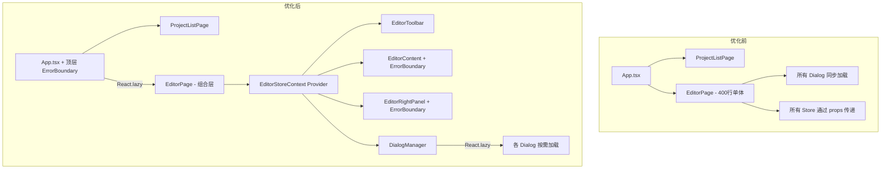
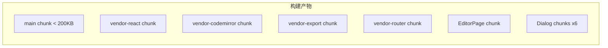
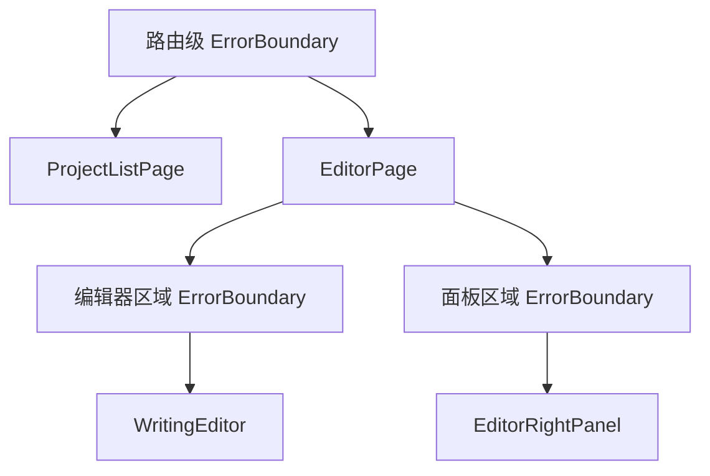

# 设计文档：项目优化（project-optimization）

## 概述

本设计文档描述火龙果编辑器（Pitaya Editor）的六项前端优化措施的技术实现方案。优化目标是：减小首屏加载体积、改善运行时性能、提升代码可维护性、增强应用容错能力。

当前痛点：
- 主包体积 1.1MB，首页加载了编辑器页面全部代码（含 CodeMirror）
- EditorPage 组件约 400 行，职责过多，所有 Store 通过 props 逐层传递
- 6 个对话框组件在 EditorPage 首次渲染时全部同步加载
- 部分组件在渲染函数内创建样式对象，造成不必要的内存分配
- 无 Error Boundary，任何组件崩溃导致整个应用白屏

优化后预期效果：
- 首页仅加载 ProjectListPage 相关代码，主包 < 200KB
- 对话框按需加载，编辑器首次可交互时间缩短
- 第三方库独立分包，浏览器可长期缓存
- EditorPage 拆分为 5+ 个职责清晰的子组件
- Error Boundary 实现三级错误隔离

## 架构

### 整体架构变更



### 分包策略



### 错误边界层级



## 组件与接口

### 1. ErrorBoundary 组件

新建通用 Error Boundary 组件，支持降级 UI 和重试。

```typescript
// src/components/ui/ErrorBoundary.tsx
interface ErrorBoundaryProps {
  children: React.ReactNode;
  fallbackTitle?: string;       // 降级 UI 标题，默认 "出错了"
  onError?: (error: Error, errorInfo: React.ErrorInfo) => void;
}

interface ErrorBoundaryState {
  hasError: boolean;
  error: Error | null;
}

class ErrorBoundary extends React.Component<ErrorBoundaryProps, ErrorBoundaryState> {
  // componentDidCatch: console.error 输出错误信息
  // getDerivedStateFromError: 设置 hasError = true
  // handleRetry: 重置 state，重新渲染子组件树
  // render: hasError 时展示降级 UI（错误摘要 + 重试按钮）
}
```

### 2. EditorStoreContext

新建 React Context，替代 EditorPage 中的 props 逐层传递。

```typescript
// src/pages/editor/EditorStoreContext.tsx
interface EditorStoreContextValue {
  projectStore: ProjectStore;
  chapterStore: ChapterStore;
  characterStore: CharacterStore;
  worldStore: WorldStore;
  timelineStore: TimelineStore;
  plotStore: PlotStore;
  relationshipStore: RelationshipStore;
  aiStore: AIAssistantStore;
  themeStore: ThemeStore;
  snapshotStore: SnapshotStore;
  consistencyEngine: ConsistencyEngine;
  exportEngine: ExportEngine;
  aiEngine: AIAssistantEngine;
  eventBus: EventBus;
}

const EditorStoreContext = React.createContext<EditorStoreContextValue | null>(null);

function EditorStoreProvider({ children, ...stores }: EditorStoreContextValue & { children: ReactNode }): JSX.Element;
function useEditorStores(): EditorStoreContextValue;  // 自定义 hook，内部 useContext + null 检查
```

### 3. EditorToolbar 组件

从 EditorPage 中提取工具栏渲染逻辑。

```typescript
// src/pages/editor/EditorToolbar.tsx
interface EditorToolbarProps {
  projectName: string;
  viewMode: ViewMode;
  onViewModeChange: (mode: ViewMode) => void;
  focusMode: boolean;
  onToggleFocus: () => void;
  effectiveTheme: 'light' | 'dark';
  onThemeToggle: () => void;
  // 其他工具栏回调...
}
```

### 4. EditorContent 组件

从 EditorPage 中提取中心内容区域。

```typescript
// src/pages/editor/EditorContent.tsx
interface EditorContentProps {
  viewMode: ViewMode;
  selectedChapterId: string | null;
  editorRef: React.RefObject<WritingEditorHandle | null>;
  showAIPanel: boolean;
  onCloseAIPanel: () => void;
  // ...
}
```

### 5. EditorRightPanel 组件

从 EditorPage 中提取右侧面板渲染逻辑。

```typescript
// src/pages/editor/EditorRightPanel.tsx
interface EditorRightPanelProps {
  panelMode: PanelMode;
  selectedCharId: string | null;
  selectedWorldId: string | null;
  selectedTimelineId: string | null;
  // 编辑/删除回调...
}
```

### 6. DialogManager 组件

集中管理所有对话框的显示状态和懒加载。

```typescript
// src/pages/editor/DialogManager.tsx
// 内部使用 React.lazy 按需加载 6 个 Dialog 组件
const LazyCharacterDialog = React.lazy(() => import('../../components/dialogs/CharacterDialog'));
const LazyWorldDialog = React.lazy(() => import('../../components/dialogs/WorldDialog'));
// ... 其余 4 个

interface DialogManagerProps {
  // 各对话框的 open 状态和回调
}
```

### 7. 路由懒加载改造（App.tsx）

```typescript
// src/App.tsx 改造
const LazyEditorPage = React.lazy(() => import('./pages/EditorPage'));

// Route 中使用 Suspense 包裹
<Route path="/editor" element={
  <Suspense fallback={<LoadingIndicator />}>
    <LazyEditorPage projectStore={projectStore} />
  </Suspense>
} />
```

### 8. Vite 分包配置

```typescript
// vite.config.ts 改造
export default defineConfig({
  plugins: [react()],
  base: '/longuo/',
  build: {
    rollupOptions: {
      output: {
        manualChunks: {
          'vendor-react': ['react', 'react-dom'],
          'vendor-router': ['react-router-dom'],
          'vendor-codemirror': [
            '@codemirror/autocomplete', '@codemirror/commands',
            '@codemirror/lang-markdown', '@codemirror/language-data',
            '@codemirror/search', '@codemirror/state', '@codemirror/view',
          ],
          'vendor-export': ['jspdf', 'jszip'],
        },
      },
    },
  },
});
```

## 数据模型

本优化不引入新的数据模型。主要变更是数据传递方式：

### Store 传递方式变更

| 变更前 | 变更后 |
|--------|--------|
| EditorPage 通过 props 将 12 个 Store/Engine 实例传递给子组件 | EditorPage 通过 `EditorStoreContext.Provider` 提供所有 Store/Engine 实例 |
| 子组件通过 props 接收所需的 Store | 子组件通过 `useEditorStores()` hook 获取所需的 Store |

### EditorStoreContextValue 类型

```typescript
interface EditorStoreContextValue {
  // 项目级
  projectStore: ProjectStore;
  projectId: string;
  projectName: string;

  // 数据 Store
  chapterStore: ChapterStore;
  characterStore: CharacterStore;
  worldStore: WorldStore;
  timelineStore: TimelineStore;
  plotStore: PlotStore;
  relationshipStore: RelationshipStore;
  aiStore: AIAssistantStore;
  themeStore: ThemeStore;
  snapshotStore: SnapshotStore;

  // Engine
  consistencyEngine: ConsistencyEngine;
  exportEngine: ExportEngine;
  aiEngine: AIAssistantEngine;
  eventBus: EventBus;
}
```

### 新增文件结构

```
src/pages/editor/
├── EditorStoreContext.tsx    # Context 定义 + Provider + useEditorStores hook
├── EditorToolbar.tsx         # 工具栏组件
├── EditorContent.tsx         # 中心内容区域组件
├── EditorRightPanel.tsx      # 右侧面板组件
└── DialogManager.tsx         # 对话框管理组件（含懒加载）

src/components/ui/
└── ErrorBoundary.tsx         # 通用 Error Boundary 组件
```


## 正确性属性（Correctness Properties）

本优化特性不包含正确性属性部分。原因如下：

本次优化涉及的六项需求均属于以下类别，不适合属性基测试（Property-Based Testing）：

1. **构建配置**（需求 1、2、3）：路由懒加载、对话框懒加载、分包策略均为 Vite/Rollup 构建配置和 React.lazy 集成，属于基础设施配置，行为不随输入变化，适合用冒烟测试和示例测试验证。
2. **组件重构**（需求 4）：EditorPage 拆分为子组件 + Context 传递，属于代码组织变更，功能行为不变，适合用回归测试验证。
3. **代码规范**（需求 5）：内联样式优化属于编码规范，不产生可测试的运行时行为。
4. **UI 错误处理**（需求 6）：Error Boundary 的行为是确定性的（捕获错误 → 展示降级 UI），不随输入有意义地变化，适合用示例测试验证。

因此，本特性的测试策略完全基于单元测试（示例测试）、冒烟测试和集成测试。

## 错误处理

### ErrorBoundary 组件错误处理

| 场景 | 处理方式 |
|------|----------|
| 子组件渲染时抛出 JavaScript 错误 | `getDerivedStateFromError` 捕获，设置 `hasError = true`，展示降级 UI |
| 降级 UI 内容 | 显示错误摘要（`error.message`）+ "重试"按钮 |
| 用户点击"重试" | 重置 `hasError = false, error = null`，重新渲染子组件树 |
| 错误日志 | `componentDidCatch` 中调用 `console.error(error, errorInfo)` |

### 懒加载失败处理

| 场景 | 处理方式 |
|------|----------|
| EditorPage 懒加载失败 | 顶层 ErrorBoundary 捕获，展示"页面加载失败"降级 UI + 重试按钮 |
| Dialog 懒加载失败 | DialogManager 内的 Suspense + ErrorBoundary 捕获，展示 Toast 错误提示，不影响编辑器主体 |

### 错误隔离策略

```
App
├── ErrorBoundary (路由级) ← 捕获页面级崩溃
│   ├── ProjectListPage
│   └── Suspense (EditorPage 懒加载)
│       └── EditorPage
│           ├── EditorToolbar (无独立 ErrorBoundary，崩溃由路由级捕获)
│           ├── ErrorBoundary (编辑器区域) ← 隔离 WritingEditor 崩溃
│           │   └── EditorContent → WritingEditor
│           ├── ErrorBoundary (面板区域) ← 隔离面板崩溃
│           │   └── EditorRightPanel
│           └── DialogManager
│               └── Suspense + ErrorBoundary (对话框) ← 隔离对话框加载/渲染错误
```

设计决策：
- EditorToolbar 不单独包裹 ErrorBoundary，因为工具栏崩溃意味着核心导航功能不可用，应由路由级 ErrorBoundary 处理
- WritingEditor 和 RightPanel 各自隔离，确保编辑器崩溃不影响面板，反之亦然
- Dialog 的 ErrorBoundary 在 DialogManager 内部，仅在对话框打开时生效

## 测试策略

### 测试框架

- 单元测试：Vitest + @testing-library/react
- 断言库：Vitest 内置 expect
- 现有测试：411 个测试全部通过，优化后必须保持全部通过

### 不使用属性基测试的原因

本特性的所有需求均属于构建配置、组件重构、编码规范或 UI 错误处理，不存在"对于所有输入 X，属性 P(X) 成立"的通用属性。因此不使用 fast-check 进行属性基测试，而是采用示例测试 + 冒烟测试 + 回归测试的组合策略。

### 测试分类

#### 冒烟测试（构建产物验证 - 需求 1、2、3）

构建产物分包验证需要实际执行 `vite build` 并检查输出文件，属于 CI 级别的冒烟测试：

- 验证构建输出包含 `vendor-react`、`vendor-codemirror`、`vendor-export`、`vendor-router` 分包文件
- 验证主包体积 < 200KB（gzip 前）
- 验证 EditorPage 被输出为独立 chunk

这些测试建议在 CI 流水线中通过构建脚本验证，而非 Vitest 单元测试。

#### 示例测试（单元测试 - 需求 4、6）

使用 Vitest + @testing-library/react 编写：

**ErrorBoundary 组件测试：**
- 正常渲染：子组件无错误时正常展示
- 错误捕获：子组件抛出错误时展示降级 UI（含错误摘要和重试按钮）
- 重试功能：点击重试按钮后重新渲染子组件
- 控制台输出：捕获错误时调用 console.error
- 自定义标题：fallbackTitle prop 正确展示

**EditorStoreContext 测试：**
- useEditorStores 在 Provider 内正确返回所有 Store
- useEditorStores 在 Provider 外抛出错误

**组件拆分回归测试：**
- EditorToolbar 渲染验证
- EditorContent 渲染验证
- EditorRightPanel 渲染验证
- DialogManager 懒加载验证

#### 集成测试（回归验证 - 需求 4、7）

- 运行现有 411 个测试，确保全部通过
- 验证 EditorPage 拆分后功能行为不变

### 测试文件结构

```
src/components/ui/ErrorBoundary.test.tsx     # ErrorBoundary 单元测试
src/pages/editor/EditorStoreContext.test.tsx  # Context + hook 测试
```
