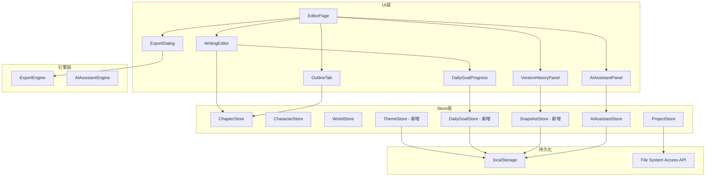
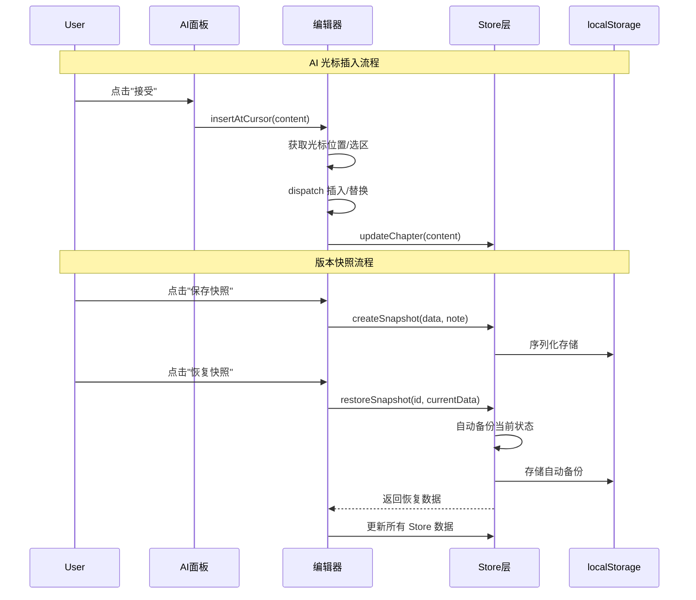

# 设计文档：火龙果编辑器体验优化

## 概述

本设计文档描述火龙果编辑器 8 项 UX 优化功能的技术实现方案。这些功能涵盖 AI 辅助写作增强、字数管理、大纲交互、视觉主题、导出排版、交叉引用、版本管理和 AI 历史记录。

项目基于 React + TypeScript + Vite 技术栈，编辑器核心使用 CodeMirror 6，数据存储采用内存 Store + localStorage 持久化模式，文件管理使用 File System Access API。

### 设计决策

1. **光标插入 vs 追加**：当前 `WritingEditorHandle` 仅暴露 `appendContent`，需新增 `insertAtCursor` 方法，利用 CodeMirror 的 `state.selection.main` 获取光标位置
2. **暗色模式实现**：通过 CSS 变量覆盖 + `data-theme` 属性实现，避免维护两套样式文件
3. **快照存储**：使用 localStorage 以项目 ID 为键隔离存储，序列化完整 `NovelFileData`
4. **交叉引用**：使用 CodeMirror Decoration API 实现角色名高亮，`@` 触发补全使用 `@codemirror/autocomplete`
5. **日更目标**：基于自然日统计，使用 localStorage 存储每日基准字数和目标值
6. **AI 历史记录**：扩展 `AIAssistantStore` 接口，localStorage 按项目 ID 隔离存储

## 架构

### 整体架构图



### 功能模块划分

| 功能 | 涉及组件 | 涉及 Store | 新增/修改 |
|------|----------|-----------|----------|
| AI 光标插入 | WritingEditor, AIAssistantPanel, EditorPage | - | 修改 |
| 日更目标 | WritingEditor (状态栏), DailyGoalProgress | DailyGoalStore | 新增 Store + 组件 |
| 大纲拖拽优化 | OutlineTab | ChapterStore | 修改 |
| 暗色模式 | globals.css, EditorPage, WritingEditor | ThemeStore | 新增 Store + CSS |
| 导出排版 | ExportDialog, ExportEngine | - | 修改 |
| 交叉引用 | WritingEditor | CharacterStore | 修改 |
| 版本快照 | VersionHistoryPanel, EditorPage | SnapshotStore | 新增 Store + 组件 |
| AI 历史记录 | AIAssistantPanel | AIAssistantStore | 修改 |


## 组件与接口

### 1. AI 光标插入

**修改 `WritingEditorHandle` 接口：**

```typescript
export interface WritingEditorHandle {
  appendContent: (content: string) => void;
  insertAtCursor: (content: string) => void;  // 新增
  getCursorPosition: () => number | null;      // 新增
}
```

`insertAtCursor` 实现逻辑：
- 获取 `viewRef.current.state.selection.main`
- 若有选中文本（`from !== to`），替换选中区域
- 若无选中文本，在 `head` 位置插入
- 若 `viewRef.current` 为 null（编辑器未聚焦），回退到 `appendContent`
- 插入后将光标移动到插入内容末尾

**修改 `EditorPage.handleAIAccept`：**
将 `editorRef.current.appendContent(content)` 改为 `editorRef.current.insertAtCursor(content)`。

### 2. 日更目标

**新增 `DailyGoalStore`：**

```typescript
interface DailyGoalConfig {
  goalWordCount: number;       // 目标字数，0 表示未设置
  baselineDate: string;        // 基准日期 YYYY-MM-DD
  baselineWordCount: number;   // 基准日开始时的总字数
}

interface DailyGoalStore {
  getConfig(projectId: string): DailyGoalConfig;
  setGoal(projectId: string, goal: number): void;
  getBaselineWordCount(projectId: string): number;
  updateBaseline(projectId: string, currentTotalWords: number): void;
  getTodayWritten(projectId: string, currentTotalWords: number): number;
}
```

localStorage key: `novel-daily-goal-{projectId}`

**新增 `DailyGoalProgress` 组件：**
嵌入 WritingEditor 状态栏，显示进度条和字数。点击弹出目标设置 popover。

### 3. 大纲拖拽优化

**修改 `OutlineTab` 组件：**

- 拖拽开始：设置 `dragImage` 为半透明克隆节点
- 拖拽经过：计算鼠标在目标节点的垂直位置（上 1/4、中间 1/2、下 1/4）
  - 上 1/4：显示上方水平线指示器（插入为同级，在目标之前）
  - 中间 1/2：高亮目标节点背景（插入为子节点）
  - 下 1/4：显示下方水平线指示器（插入为同级，在目标之后）
- 层级验证：卷不能拖入章内，章不能拖入节内
- 释放后：使用 CSS `transition` 实现平滑移动动画
- 更新 `sortOrder` 和 `parentId`

新增状态：
```typescript
type DropPosition = 'before' | 'inside' | 'after';
const [dropInfo, setDropInfo] = useState<{ targetId: string; position: DropPosition } | null>(null);
```

### 4. 暗色模式

**新增 `ThemeStore`：**

```typescript
type ThemeMode = 'light' | 'dark' | 'system';

interface ThemeStore {
  getTheme(): ThemeMode;
  setTheme(mode: ThemeMode): void;
  getEffectiveTheme(): 'light' | 'dark';  // 解析 system 后的实际主题
}
```

localStorage key: `novel-theme-preference`

**CSS 变量覆盖（globals.css）：**

```css
[data-theme="dark"] {
  --color-primary: #E2E8F0;
  --color-accent: #63B3ED;
  --color-bg: #1A202C;
  --color-card: #2D3748;
  --color-text: #E2E8F0;
  --color-text-secondary: #A0AEC0;
  --color-border: #4A5568;
  --color-error: #FC8181;
  --color-success: #68D391;
  --color-warning: #F6AD55;
}
```

**CodeMirror 暗色主题：**
创建 `darkEditorTheme` 使用 `EditorView.theme` 覆盖编辑器区域的背景、文字、行号等颜色。

**切换按钮：** 在 EditorPage 工具栏添加 🌙/☀️ 切换按钮。

### 5. 导出排版选项

**扩展 `ExportOptions`：**

```typescript
interface TypographyOptions {
  fontFamily: string;    // 默认 "宋体"
  fontSize: number;      // 默认 12 (pt)
  lineHeight: number;    // 默认 1.5
  marginMm: number;      // 默认 20 (mm)
}

interface ExportOptions {
  format: 'pdf' | 'epub' | 'markdown' | 'chapter-txt';
  title: string;
  author: string;
  typography?: TypographyOptions;  // 新增
}
```

localStorage key: `novel-export-typography`

**修改 `ExportDialog`：** 添加排版参数输入区域（字体、字号、行距、页边距）。

**修改 `ExportEngine`：**
- PDF：将 `jsPDF` 的 `setFontSize`、margin、lineHeight 参数化
- EPUB：在生成的 XHTML 中注入 `<style>` 标签应用排版参数

### 6. 角色/世界观交叉引用

**CodeMirror 扩展：**

- **高亮 Decoration**：使用 `ViewPlugin` + `Decoration.mark` 扫描文档内容，匹配角色名和别名，添加高亮样式
- **自动补全**：使用 `@codemirror/autocomplete` 的 `autocompletion` 扩展，监听 `@` 字符触发补全
- **Tooltip**：使用 `@codemirror/view` 的 `hoverTooltip` 扩展，鼠标悬停在高亮角色名上显示角色信息

```typescript
// 新增 CodeMirror 扩展工厂函数
function createCrossReferenceExtension(
  getCharacters: () => Character[]
): Extension[]
```

### 7. 版本快照

**新增 `SnapshotStore`：**

```typescript
interface Snapshot {
  id: string;
  projectId: string;
  timestamp: Date;
  note: string;
  data: NovelFileData;
  totalWordCount: number;
}

interface SnapshotStore {
  createSnapshot(projectId: string, data: NovelFileData, note: string): Snapshot;
  listSnapshots(projectId: string): Snapshot[];  // 按时间倒序
  getSnapshot(id: string): Snapshot | undefined;
  deleteSnapshot(id: string): void;
  restoreSnapshot(id: string, currentData: NovelFileData): NovelFileData;  // 返回恢复后的数据
}
```

localStorage key: `novel-snapshots-{projectId}`

`restoreSnapshot` 逻辑：
1. 自动创建当前状态的快照（备注："恢复前自动备份"）
2. 返回目标快照的 `data` 副本

**新增 `VersionHistoryPanel` 组件：**
侧滑面板，显示快照列表，支持查看详情和恢复操作。

### 8. AI 历史记录

**扩展 `AIAssistantStore` 接口：**

```typescript
interface AIHistoryRecord {
  id: string;
  projectId: string;
  timestamp: Date;
  skillLabel: string;     // 技能类型标签
  userInput: string;      // 用户输入
  generatedContent: string; // 生成结果
}

// 新增方法
interface AIAssistantStore {
  // ... 现有方法
  addHistoryRecord(projectId: string, record: Omit<AIHistoryRecord, 'id' | 'timestamp'>): AIHistoryRecord;
  listHistory(projectId: string): AIHistoryRecord[];  // 按时间倒序
  getHistoryRecord(id: string): AIHistoryRecord | undefined;
  clearHistory(projectId: string): void;
}
```

localStorage key: `novel-ai-history-{projectId}`

最大记录数：50 条，超出时自动删除最早的记录。

**修改 `AIAssistantPanel`：**
- 生成完成后调用 `addHistoryRecord`
- 面板底部添加"历史记录"折叠区域
- 点击历史记录显示完整内容，提供"插入到编辑器"和"重新生成"按钮


## 数据模型

### 新增类型定义

```typescript
// src/types/theme.ts
export type ThemeMode = 'light' | 'dark' | 'system';

// src/types/daily-goal.ts
export interface DailyGoalConfig {
  goalWordCount: number;
  baselineDate: string;        // YYYY-MM-DD
  baselineWordCount: number;
}

// src/types/snapshot.ts
export interface Snapshot {
  id: string;
  projectId: string;
  timestamp: string;           // ISO 8601
  note: string;
  data: NovelFileData;
  totalWordCount: number;
}

// src/types/ai.ts (扩展)
export interface AIHistoryRecord {
  id: string;
  projectId: string;
  timestamp: string;           // ISO 8601
  skillLabel: string;
  userInput: string;
  generatedContent: string;
}
```

### 扩展现有类型

```typescript
// src/types/export.ts (扩展)
export interface TypographyOptions {
  fontFamily: string;
  fontSize: number;
  lineHeight: number;
  marginMm: number;
}

export interface ExportOptions {
  format: 'pdf' | 'epub' | 'markdown' | 'chapter-txt';
  title: string;
  author: string;
  typography?: TypographyOptions;
}
```

### localStorage 键值设计

| 功能 | Key 格式 | 值类型 |
|------|---------|--------|
| 主题偏好 | `novel-theme-preference` | `ThemeMode` |
| 日更目标 | `novel-daily-goal-{projectId}` | `DailyGoalConfig` |
| 快照数据 | `novel-snapshots-{projectId}` | `Snapshot[]` |
| AI 历史 | `novel-ai-history-{projectId}` | `AIHistoryRecord[]` |
| 导出排版 | `novel-export-typography` | `TypographyOptions` |

### 数据流图




## 正确性属性

*属性（Property）是指在系统所有有效执行中都应成立的特征或行为——本质上是对系统应做什么的形式化陈述。属性是人类可读规格说明与机器可验证正确性保证之间的桥梁。*

### Property 1: 光标插入保持周围文本不变

*For any* 文档内容和任意光标位置（0 到文档长度之间），插入任意非空文本后，插入点之前的文本和插入点之后的文本应与原文档对应部分完全一致。

**Validates: Requirements 1.1, 1.2**

### Property 2: 选区替换保持周围文本不变

*For any* 文档内容和任意有效选区范围（from < to），用任意文本替换选区后，结果应等于 `doc[0..from] + replacement + doc[to..end]`。

**Validates: Requirements 1.3**

### Property 3: 日更字数差值计算与日期边界

*For any* 基准日期、基准字数、当前日期和当前总字数，当当前日期等于基准日期时，今日已写字数应等于 `currentTotal - baseline`；当当前日期不等于基准日期时，基准应重置为当前总字数，今日已写字数应为 0。

**Validates: Requirements 2.3, 2.5**

### Property 4: 拖拽放置位置计算与层级验证

*For any* 目标节点高度和鼠标 Y 偏移量，放置位置应根据偏移比例正确计算（上 1/4 为 before，中间 1/2 为 inside，下 1/4 为 after）。同时，*for any* 源节点层级和目标放置模式，卷不能成为章的子节点，章不能成为节的子节点。

**Validates: Requirements 3.3, 3.5**

### Property 5: 重排序正确更新 sortOrder 和 parentId

*For any* 有效的章节树和合法的拖拽操作，执行重排序后，目标节点的 `sortOrder` 和 `parentId` 应正确更新，且同一父节点下所有子节点的 `sortOrder` 应为连续的从 0 开始的整数序列。

**Validates: Requirements 3.6**

### Property 6: 主题偏好持久化往返

*For any* 有效的 ThemeMode 值（'light' | 'dark' | 'system'），设置主题后再读取应返回相同的值。

**Validates: Requirements 4.5, 4.6**

### Property 7: EPUB 排版 CSS 生成

*For any* 有效的 TypographyOptions（字体名、字号 > 0、行距 > 0、页边距 >= 0），生成的 CSS 字符串应包含对应的 `font-family`、`font-size`、`line-height` 和 `margin` 值。

**Validates: Requirements 5.4**

### Property 8: 排版参数持久化往返

*For any* 有效的 TypographyOptions，保存到 localStorage 后再读取应返回等价的对象。

**Validates: Requirements 5.6**

### Property 9: 角色名匹配

*For any* 角色列表（含名称和别名）和包含这些名称的文档文本，匹配函数应找到所有角色名出现的位置，且每个匹配的起止位置应正确对应文档中的角色名文本。

**Validates: Requirements 6.1**

### Property 10: 自动补全过滤

*For any* 角色名称列表和查询字符串，过滤函数返回的每个结果的名称或别名应包含查询字符串作为子串，且所有匹配的角色都应出现在结果中。

**Validates: Requirements 6.3**

### Property 11: 快照数据往返

*For any* 有效的 NovelFileData 和备注字符串，创建快照后通过 ID 获取该快照，其 `data` 字段应与原始数据深度相等，`note` 字段应与原始备注一致。

**Validates: Requirements 7.1, 7.2**

### Property 12: 快照列表按项目隔离且按时间倒序

*For any* 两个不同的项目 ID 和各自的快照序列，`listSnapshots(projectA)` 应仅包含项目 A 的快照且按时间戳降序排列，不包含项目 B 的任何快照。

**Validates: Requirements 7.3, 7.6**

### Property 13: 快照恢复自动备份

*For any* 当前项目数据和目标快照，调用 `restoreSnapshot` 后，快照列表中应新增一条备注为"恢复前自动备份"的快照，其数据应与恢复前的当前数据一致。

**Validates: Requirements 7.4**

### Property 14: AI 历史记录往返

*For any* 有效的技能标签、用户输入和生成内容，添加历史记录后通过 ID 获取该记录，所有字段应与原始输入一致。

**Validates: Requirements 8.1**

### Property 15: AI 历史列表按项目隔离、时间倒序且上限 50 条

*For any* 项目 ID 和任意数量的历史记录（包括超过 50 条的情况），`listHistory` 应仅返回该项目的记录、按时间戳降序排列、且数量不超过 50 条。当记录超过 50 条时，最早的记录应被删除。

**Validates: Requirements 8.2, 8.5, 8.6**


## 错误处理

### AI 光标插入
- 编辑器未挂载（`viewRef.current` 为 null）：回退到 `appendContent`
- 光标位置超出文档范围：clamp 到有效范围

### 日更目标
- localStorage 读取失败：使用默认值（目标 0，不显示进度条）
- 字数计算溢出：使用 `Math.min(percentage, 100)` 限制进度百分比

### 大纲拖拽
- 无效拖拽目标（层级不兼容）：取消拖拽，恢复原位
- 拖拽到自身或自身后代：忽略操作
- `dataTransfer` 数据丢失：静默忽略

### 暗色模式
- localStorage 不可用：使用系统偏好作为默认值
- `matchMedia` 不支持：默认使用亮色模式

### 导出排版
- 无效排版参数（字号 <= 0、行距 <= 0）：使用默认值替代
- 字体不可用：jsPDF 回退到默认字体

### 交叉引用
- 角色列表为空：不创建任何 Decoration
- 角色名包含正则特殊字符：转义后再匹配
- 大量角色名导致性能问题：限制扫描频率（debounce），仅扫描可视区域

### 版本快照
- localStorage 存储空间不足：捕获 `QuotaExceededError`，提示用户删除旧快照
- 快照数据反序列化失败：跳过损坏的快照，显示错误提示
- 恢复时自动备份失败：中止恢复操作，保持当前数据不变

### AI 历史记录
- localStorage 读取/写入失败：静默降级，不影响 AI 生成功能
- 历史记录数据损坏：清空该项目的历史记录

## 测试策略

### 属性测试（Property-Based Testing）

使用 `fast-check` 库进行属性测试，每个属性测试至少运行 100 次迭代。

每个测试需标注对应的设计属性：
```
// Feature: ux-enhancements, Property 1: 光标插入保持周围文本不变
```

**适用属性测试的功能：**

| Property | 测试目标 | 生成器 |
|----------|---------|--------|
| 1 | `insertAtCursor` 文本操作 | `fc.string()`, `fc.nat()` |
| 2 | 选区替换文本操作 | `fc.string()`, `fc.nat()` (from, to) |
| 3 | `DailyGoalStore.getTodayWritten` | `fc.date()`, `fc.nat()` |
| 4 | 拖拽位置计算 + 层级验证 | `fc.nat()`, `fc.constantFrom('volume','chapter','section')` |
| 5 | `ChapterStore.reorderChapter` | 随机章节树生成器 |
| 6 | `ThemeStore` 往返 | `fc.constantFrom('light','dark','system')` |
| 7 | EPUB CSS 生成 | `fc.record({fontFamily: fc.string(), fontSize: fc.double({min:1}), ...})` |
| 8 | `TypographyOptions` 往返 | 同上 |
| 9 | 角色名匹配 | `fc.array(fc.string())`, 文档生成器 |
| 10 | 自动补全过滤 | `fc.array(fc.string())`, `fc.string()` |
| 11 | `SnapshotStore` 数据往返 | 随机 `NovelFileData` 生成器 |
| 12 | 快照列表隔离+排序 | `fc.uuid()`, 随机快照序列 |
| 13 | 快照恢复自动备份 | 随机 `NovelFileData` 对 |
| 14 | `AIHistoryRecord` 往返 | `fc.string()` 组合 |
| 15 | AI 历史列表隔离+排序+上限 | `fc.uuid()`, `fc.array()` |

### 单元测试（Example-Based）

针对不适合属性测试的验收标准编写具体示例测试：

- **1.4**: 编辑器未聚焦时回退到追加行为
- **1.5**: 插入成功后显示 toast 提示
- **2.1/2.2**: 进度条渲染和设置界面交互
- **2.4/2.6**: 目标达成状态和目标为 0 时隐藏
- **3.1/3.2/3.4**: 拖拽视觉效果（半透明预览、指示器、动画）
- **4.1-4.4**: 暗色模式 UI 切换和 CSS 变量
- **4.7**: 系统偏好默认暗色模式
- **5.1/5.2/5.5**: 导出对话框渲染和默认值
- **6.2/6.4/6.5/6.6**: 自动补全交互和 tooltip
- **7.5**: 损坏快照恢复错误处理
- **8.3/8.4**: 历史记录 UI 交互

### 测试文件组织

```
src/stores/daily-goal-store.test.ts          # Property 3
src/stores/theme-store.test.ts               # Property 6
src/stores/snapshot-store.test.ts            # Property 11, 12, 13
src/stores/ai-assistant-store.test.ts        # Property 14, 15 (扩展现有)
src/lib/export-engine.test.ts                # Property 7, 8 (扩展现有)
src/lib/cursor-insertion.test.ts             # Property 1, 2
src/lib/cross-reference.test.ts              # Property 9, 10
src/components/sidebar/OutlineTab.test.ts    # Property 4, 5
```
