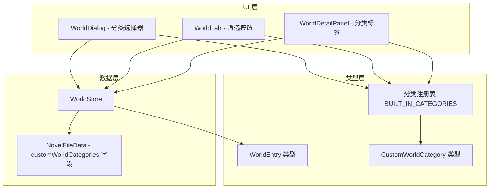
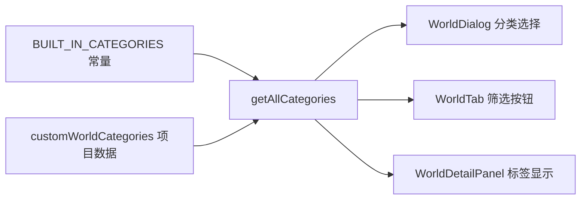

# 设计文档：世界观分类体系扩展

## 概述

本功能扩展小说写作助手的世界观模块分类体系。当前系统仅支持三种硬编码分类（`location`、`faction`、`rule`），无法满足奇幻、科幻、修仙等多种题材的世界观构建需求。

本次扩展包含两个核心变更：
1. 将内置分类从 3 种扩展到 11 种，新增物品/道具、种族/物种、魔法/能力体系、历史/事件、文化/习俗、科技/技术、货币/经济、宗教/信仰
2. 支持用户在项目级别创建自定义分类，实现分类体系的开放性

### 关键设计决策

1. **分类注册表模式**：使用集中的 `BUILT_IN_CATEGORIES` 常量数组定义所有内置分类的 key、label、color，避免在多个组件中重复硬编码。
2. **type 字段扩展为 string**：将 `WorldEntry.type` 从联合类型 `'location' | 'faction' | 'rule'` 扩展为 `string`，以支持自定义分类标识符，同时保持向后兼容。
3. **项目级自定义分类**：自定义分类存储在 `NovelFileData` 中（新增 `customWorldCategories` 字段），随项目文件持久化，不同项目的自定义分类互相独立。
4. **删除分类回退策略**：删除已被引用的自定义分类时，相关条目的 type 回退为 `'rule'`（默认内置分类），确保数据不会处于无效状态。

## 架构

本功能的变更范围集中在世界观模块内部，不涉及跨模块架构变更。



### 变更影响范围

| 文件 | 变更类型 | 说明 |
|------|----------|------|
| `src/types/world.ts` | 修改 | 扩展 `WorldEntry.type` 为 string，新增 `CustomWorldCategory` 接口，新增 `BUILT_IN_CATEGORIES` |
| `src/types/project.ts` | 修改 | `NovelFileData` 新增 `customWorldCategories` 字段 |
| `src/types/stores.ts` | 修改 | `WorldStore` 接口新增自定义分类管理方法 |
| `src/stores/world-store.ts` | 修改 | 实现自定义分类 CRUD 和删除回退逻辑 |
| `src/components/dialogs/WorldDialog.tsx` | 修改 | 展示所有分类选项，支持内联创建自定义分类 |
| `src/components/sidebar/WorldTab.tsx` | 修改 | 展示所有分类筛选按钮 |
| `src/components/panels/WorldDetailPanel.tsx` | 修改 | 支持所有分类的标签颜色显示 |

## 组件与接口

### 分类注册表（Category Registry）

```typescript
/** 内置分类定义 */
interface BuiltInCategory {
  key: string;       // 英文标识符，如 'location'
  label: string;     // 中文显示名称，如 '地点'
  color: { bg: string; text: string }; // 标签颜色
}

/** 11 种内置分类 */
const BUILT_IN_CATEGORIES: BuiltInCategory[] = [
  { key: 'location',   label: '地点',       color: { bg: '#EBF8FF', text: '#3182CE' } },
  { key: 'faction',    label: '势力',       color: { bg: '#FAF5FF', text: '#9F7AEA' } },
  { key: 'rule',       label: '规则',       color: { bg: '#FFF5F5', text: '#E53E3E' } },
  { key: 'item',       label: '物品/道具',  color: { bg: '#FFFFF0', text: '#D69E2E' } },
  { key: 'race',       label: '种族/物种',  color: { bg: '#F0FFF4', text: '#38A169' } },
  { key: 'magic',      label: '魔法/能力',  color: { bg: '#EBF4FF', text: '#5A67D8' } },
  { key: 'history',    label: '历史/事件',  color: { bg: '#FFF5F7', text: '#D53F8C' } },
  { key: 'culture',    label: '文化/习俗',  color: { bg: '#FEFCBF', text: '#B7791F' } },
  { key: 'technology', label: '科技/技术',  color: { bg: '#E6FFFA', text: '#319795' } },
  { key: 'economy',    label: '货币/经济',  color: { bg: '#FED7D7', text: '#C53030' } },
  { key: 'religion',   label: '宗教/信仰',  color: { bg: '#E9D8FD', text: '#6B46C1' } },
];

/** 默认自定义分类颜色 */
const CUSTOM_CATEGORY_DEFAULT_COLOR = { bg: '#EDF2F7', text: '#4A5568' };
```

### 自定义分类类型

```typescript
/** 用户自定义的世界观分类 */
interface CustomWorldCategory {
  key: string;    // 自动生成的唯一标识符（UUID）
  label: string;  // 用户输入的分类名称
}
```

### WorldEntry 类型变更

```typescript
/** 世界观条目（扩展后） */
interface WorldEntry {
  id: string;
  projectId: string;
  type: string;  // 从 'location' | 'faction' | 'rule' 扩展为 string
  name: string;
  description: string;
  category?: string;
  associatedCharacterIds: string[];
}
```

### NovelFileData 变更

```typescript
interface NovelFileData {
  // ... 现有字段不变
  customWorldCategories?: CustomWorldCategory[]; // 新增：项目级自定义分类列表
}
```

### WorldStore 接口扩展

```typescript
interface WorldStore {
  // ... 现有方法不变

  // 自定义分类管理
  listCustomCategories(projectId: string): CustomWorldCategory[];
  addCustomCategory(projectId: string, label: string): CustomWorldCategory;
  updateCustomCategory(projectId: string, key: string, label: string): void;
  deleteCustomCategory(projectId: string, key: string): void;
  // 获取所有可用分类（内置 + 自定义）
  getAllCategories(projectId: string): Array<{ key: string; label: string; color: { bg: string; text: string }; isBuiltIn: boolean }>;
}
```

### WorldDialog 组件变更

```typescript
interface WorldDialogProps {
  open: boolean;
  initialData?: WorldEntry;
  projectId: string;
  characters: Character[];
  customCategories: CustomWorldCategory[]; // 新增：传入自定义分类列表
  onConfirm: (data: WorldFormData) => void;
  onCancel: () => void;
  onAddCustomCategory?: (label: string) => void; // 新增：内联创建自定义分类回调
}
```

## 数据模型

### 分类数据流



### 自定义分类存储结构

自定义分类存储在 `NovelFileData.customWorldCategories` 数组中，随 `.novel` 文件持久化：

```json
{
  "customWorldCategories": [
    { "key": "uuid-1", "label": "灵兽" },
    { "key": "uuid-2", "label": "阵法" }
  ]
}
```

### 向后兼容性

- 旧版 `.novel` 文件不包含 `customWorldCategories` 字段，读取时默认为空数组
- 旧版文件中 `WorldEntry.type` 值为 `'location'`、`'faction'`、`'rule'`，这些值在新系统中仍然有效
- `filterByType` 方法已支持按任意字符串筛选，无需修改核心逻辑


## 正确性属性

*正确性属性是一种在系统所有有效执行中都应成立的特征或行为——本质上是对系统应做什么的形式化陈述。属性是人类可读规范与机器可验证正确性保证之间的桥梁。*

### 属性 1：WorldEntry type 字段通用性

*For any* 非空字符串作为 type 值（包括 11 种内置分类标识符和任意自定义分类标识符），创建 WorldEntry 后读取应返回与输入一致的 type 值，且所有 Store 操作（create、get、list、filter、search、update、delete）均正常工作。

**Validates: Requirements 1.5, 3.4, 6.1**

### 属性 2：自定义分类 CRUD 往返一致性

*For any* 有效的自定义分类名称（非空、非纯空白、不与已有分类重复），创建后应出现在自定义分类列表中且 label 一致；更新名称后再次读取应反映新名称；删除后应从列表中消失。

**Validates: Requirements 2.1, 2.5, 2.6**

### 属性 3：自定义分类名称验证

*For any* 空字符串或纯空白字符串，创建自定义分类应被拒绝；*For any* 已存在的分类名称（内置分类的 label 或已有自定义分类的 label），创建同名自定义分类应被拒绝，且现有分类列表不受影响。

**Validates: Requirements 2.2, 2.3, 2.4**

### 属性 4：删除自定义分类条目回退

*For any* 被一个或多个 WorldEntry 引用的自定义分类，删除该分类后，所有引用该分类的条目的 type 字段应变为 `'rule'`，且未引用该分类的条目不受影响。

**Validates: Requirements 2.7**

### 属性 5：按分类筛选正确性（扩展）

*For any* 包含混合类型（内置和自定义）的 WorldEntry 集合，以及任意分类标识符字符串，`filterByType` 返回的结果应仅包含 type 等于该标识符的条目，且不遗漏任何匹配条目。

**Validates: Requirements 4.4, 6.3**

### 属性 6：自定义分类持久化往返一致性

*For any* 自定义分类列表，将其作为 `NovelFileData.customWorldCategories` 序列化为 JSON 后再反序列化，应产生与原始列表完全等价的结果。

**Validates: Requirements 6.4**

## 错误处理

| 场景 | 处理策略 |
|------|----------|
| 创建自定义分类时名称为空或纯空白 | 阻止创建，返回错误信息或抛出异常 |
| 创建自定义分类时名称与已有分类重复 | 阻止创建，返回错误信息提示名称已存在 |
| 删除已被 WorldEntry 引用的自定义分类 | 提示用户确认，确认后将相关条目 type 回退为 `'rule'` |
| WorldEntry 的 type 引用了不存在的分类 | UI 层使用 type 原始值作为标签文本，使用默认灰色颜色 |
| 旧版 `.novel` 文件无 `customWorldCategories` 字段 | 读取时默认为空数组，保持向后兼容 |
| 编辑自定义分类名称为空或与已有分类重复 | 阻止更新，返回错误信息 |

## 测试策略

### 属性测试（Property-Based Testing）

使用 `fast-check`（项目已安装）编写属性测试，每个属性测试至少运行 100 次迭代。

属性测试覆盖的核心领域：
- **type 字段通用性** (P1)：验证任意字符串 type 的 CRUD 操作正确性
- **自定义分类 CRUD** (P2)：验证自定义分类的创建-读取-更新-删除往返一致性
- **名称验证** (P3)：验证空名称和重复名称的拒绝逻辑
- **删除回退** (P4)：验证删除分类后条目 type 的回退行为
- **筛选正确性** (P5)：验证 filterByType 对任意类型字符串的过滤准确性
- **持久化往返** (P6)：验证自定义分类的序列化/反序列化一致性

每个属性测试必须以注释标注对应的设计属性：

```typescript
// Feature: world-category-expansion, Property 1: WorldEntry type 字段通用性
```

### 单元测试

单元测试覆盖属性测试不适合的场景：
- **UI 渲染**：WorldDialog 展示所有分类选项（需求 1.4, 3.1）、WorldTab 筛选按钮排列（需求 4.1, 4.2）、WorldDetailPanel 标签颜色（需求 5.1, 5.2）
- **静态配置**：BUILT_IN_CATEGORIES 包含 11 种分类且 key/label/color 完整（需求 1.1, 1.2, 1.3）
- **边界情况**：已删除分类的 fallback 显示（需求 5.3）
- **布局行为**：分类选项溢出时的滚动/换行（需求 3.2, 4.3）

### 测试框架

- **单元测试 / 属性测试**：Vitest + fast-check
- **组件测试**：React Testing Library（可选）
